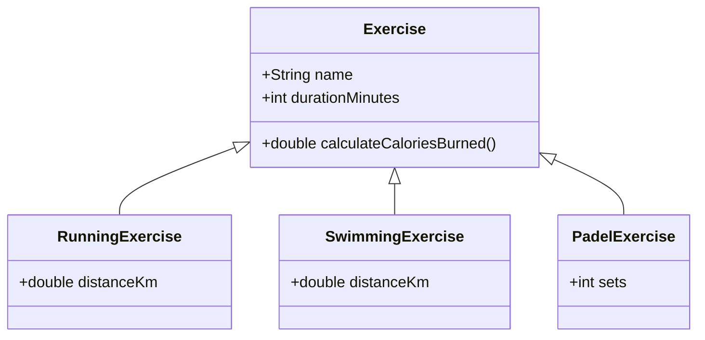

# Perintä ja rajapinnat
{: .no_toc }

Perintä (inheritance) ja rajapinnat (interfaces) ovat olio-ohjelmoinnin ratkaisuja koodin uudelleenkäytettävyyden ja yhteensopivuuden edistämiseksi. Interface määrittää metodin nimet, paluuarvot ja parametrit.
{: .fs-6 }

---

## Tällä sivulla:
{: .no_toc .text-delta }

* Sisällysluettelo
{:toc}

Jos esimerkiksi netin kauppapaikalla on myynnissä monenlaisia tuotteita esineistä asuntoihin ja ajoneuvoihin, voidaan kaikille tuotteille yhteiset ominaisuudet toteuttaa yhteen luokkaan, jota voidaan laajentaa tapauskohtaisten aliluokkien avulla. Näin vältetään toteuttamasta samoja yhteisiä ominaisuuksia moneen luokkaan. Samalla koodin yhteensopivuus paranee, kun aliluokkien oliot ovat yhteensopivia yliluokan olioiden kanssa. Perinnän avulla sekä autoja, asuntoja että muita tuotteita voidaankin tarvittaessa käsitellä esimerkiksi samalla listalla.

Perintää käytetään usein tilanteissa, joissa on olemassa jo jokin toteutus, jota halutaan laajentaa erityistapauksen avulla. Rajapintoja puolestaan käytetään usein tilanteissa, joissa selvää yhteistä toteutusta ei ole. Toisin kuin luokat, rajapinnat ovat abstrakteja, eli niistä ei voida luoda olioita. Rajapintojen avulla voidaan kuitenkin määritellä yksi tai useampia metodeja, jotka rajapinnan täyttävien luokkien on toteutettava.


## Perintä

> *"Perintä on väline käsitehierarkioiden rakentamiseen ja erikoistamiseen; aliluokka on aina yliluokan erikoistapaus. Jos luotava luokka on olemassaolevan luokan erikoistapaus, voidaan uusi luokka luoda perimällä olemassaoleva luokka. Esimerkiksi auton osiin liittyvässä esimerkissä moottori on osa, mutta moottoriin liittyy lisätoiminnallisuutta mitä jokaisella osalla ei ole."*
>
> Lähde: [Helsingin Yliopiston Agile Education Research –tutkimusryhmä. Perintä. mooc.fi](https://ohjelmointi-20.mooc.fi/osa-9/1-perinta)


Opetuskalvot [PowerPoint-kalvot löydät täältä](/kalvot/perinta-ja-rajapinnat.pdf).


### Exercise ja sen aliluokat



### Perintäesimerkki 

**Henkilo-luokka**
```java
package perinta;

public class Henkilo {
    String etunimi;
    String sukunimi;
    String email;
    
    public Henkilo(String etunimi, String sukunimi, String email) {
        this.etunimi = etunimi;
        this.sukunimi = sukunimi;
        this.email = email;
    }

    public String getEtunimi() {
        return etunimi;
    }

    public String getSukunimi() {
        return sukunimi;
    }

    public String getEmail() {
        return email;
    }

    public void setEmail(String email) {
        this.email = email;
    }

    @Override
    public String toString() {
        return "Henkilo [etunimi=" + etunimi + ", sukunimi=" + sukunimi + ", email=" + email + "]";
    }
}

```

Henkilo-luokka sisältää henkilön perustietoja, jos ollaan tekemässä oppilaitoksen järjestelmään, tarvitaan vielä ainakin Opiskelija-luokka. Oppilaalla on nimi, sähköposti ja lisäksi opiskelijanumero ja aloitusvuosi (toki oikeasti paljon muitakin ominaisuuksia). Periytyminse avulla voidaan hyödyntää Henkilo-luokkaa Opiskelija-luokkaa määriteltäessä. Huomaa seuraavassa koodiesimerkissä varatut sanat **extends**, **super** ja annotaatio **@Override**. 

```java
package perinta;

public class Opiskelija extends Henkilo {
    String opiskelijanumero;
    int aloitusvuosi;
    
    public Opiskelija(String etunimi, String sukunimi, String email, String opiskelijanumero, int aloitusvuosi) {
        super(etunimi, sukunimi, email);
        this.opiskelijanumero = opiskelijanumero;
        this.aloitusvuosi = aloitusvuosi;
    }

    public String getOpiskelijanumero() {
        return opiskelijanumero;
    }

    public int getAloitusvuosi() {
        return aloitusvuosi;
    }
  
    @Override
    public String toString() {
        return super.toString() +  " Opiskelija [opiskelijanumero=" + opiskelijanumero + ", aloitusvuosi=" + aloitusvuosi + "]";
    }
}
```

Henkilo-luokka on yliluokka (yläluokka, super class), käytetään myös termiä kantaluokka (base class). Opiskelija-luokka on aliluokka (sub class) tai johdettu luokka (derived class). Opiskelija-luokka perii kaikki kentät ja metodit kantaluokalta, periminen määritellään extends sanalla. **Luokka voi periä vain yhden luokan**, moniperiytyminen on estetty Java-kielessä. Luokka voi toteuttaa useita rajapintoja.

Opiskelija-luokassa huomaa miten aliluokassa käytetään hyväksi yliluokan konstruktoria (super(etunimi, sukunimi, email);) sekä toString-metodissa super.toString(). Super viittaa aina kantaluokkaan. Kontruktorissa kantaluokan konstruktorin kutsuminen super-määrittelyllä on pakko olla ensimmäinen lause.

Henkilo-luokassa on toString()-metodi määritelty. Metodit voidaan ylikirjoittaa aliluokissa, tässä esimerkissä tulostataan nimen lisäksi opiskelijanumero ja aloitusvuosi. Ylikirjoitus on syytä toteuttaa käyttämällä @Override-annotaatiota.

Lisätään vielä Opettaja-luokka:
```java
package perinta;

public class Opettaja extends Henkilo {
    String opettajanumero;

    public Opettaja(String etunimi, String sukunimi, String email, String opettajanumero) {
        super(etunimi, sukunimi, email);
        this.opettajanumero = opettajanumero;
    }

    public String getOpettajanumero() {
        return opettajanumero;
    }

    @Override
    public String toString() {
        return super.toString() + "Opettaja [opettajanumero=" + opettajanumero + "]";
    }
}
```
Sekä opettaja että opiskelija sisältävät nimen ja sähköpostiosoitteen. Näiden lisäksi molemmilla aliluokilla on jotain omina ominaisuuksia. Koska molemmilla on sama yliluokka, voidaan niitä käsitellä täysin samalla tavalla. Tehdään vaikka pieni koodipätkä, jolla tehdään lista opettajista ja oppilaista, jotka osallistuvat ohjattuun taukojumppaan. 
```java
List<Henkilo> osallistujat = new ArrayList<>();
osallistujat.add(new Opettaja("Teemu", "Terävä", "tt@hotmail.com", "h1234"));
osallistujat.add(new Opiskelija("Olivia", "Ahkera", "b987@hh.fi", "b987", 2018));
osallistujat.add(new Opiskelija("Olli", "Oppilas", "b123@hh.fi", "b123", 2023));
osallistujat.add(new Opettaja("Jukka", "Nokkela", "juno@gmail.com", "h9876"));

System.out.println("Taukotilaisuuteen osallistujat: ");
for (Henkilo h : osallistujat) {
    System.out.println(h);
}
```

&nbsp;

---

## Rajapinnat

> *"Rajapinnan (engl. interface) avulla määritellään luokalta vaadittu käyttäytyminen, eli sen metodit. Rajapinnat määritellään kuten normaalit Javan luokat, mutta luokan alussa olevan määrittelyn "public class ..." sijaan käytetään määrittelyä "public interface ...". Rajapinnat määrittelevät käyttäytymisen metodien niminä ja palautusarvoina, mutta ne eivät aina sisällä metodien konkreettista toteutusta. Näkyvyysmäärettä rajapintoihin ei erikseen merkitä, sillä se on aina public."*
>
> Lähde: [Helsingin Yliopiston Agile Education Research –tutkimusryhmä. Rajapinta. mooc.fi](https://ohjelmointi-20.mooc.fi/osa-9/2-rajapinta)


### [Rajapinnat]

[PowerPoint-kalvot](/kalvot/perinta-ja-rajapinnat.pdf)


### Tehtävä: Maat (Comparable-rajapinta)

Täydennä valmista `Country`-luokkaa siten, että luokka täyttää [Javan standardikirjaston valmiin `Comparable`-rajapinnan](https://docs.oracle.com/javase/8/docs/api/java/lang/Comparable.html).

Comparable-rajapinta on hyödyllinen esimerkiksi tapauksissa, joissa haluat määritellä oman luokkasi olioille järjestyksen:

> *"Lists (and arrays) of objects that implement this interface can be sorted automatically by Collections.sort (and Arrays.sort).*"
>
> [Java API. Comparable. oracle.com](https://docs.oracle.com/javase/8/docs/api/java/lang/Comparable.html)

Toteutettuasi tämän rajapinnan, voit siis esimerkiksi järjestää oman luokkasi oliot `Collections.sort`-metodilla tai etsiä niistä suurimman `Collections.max`-metodilla. Itse Comparable-rajapinnan lähdekoodi näyttää kutakuinkin seuraavalta:

```java
// Huom! Älä kopioi tätä itsellesi! Comparable löytyy Javasta valmiina!
public interface Comparable<T> {
    /**
     * https://docs.oracle.com/javase/8/docs/api/java/lang/Comparable.html
     *
     * @return a negative integer, zero, or a positive integer as
     *         this object is less than, equal to, or greater than
     *         the specified object.
     */
    int compareTo(T other);
}
```

Lähdekoodista näemme, että rajapintaan on määritetty ainoastaan yksi metodi: `compareTo`. Metodille on määritelty paluuarvo (int) sekä parametrimuuttuja, mutta itse metodin toteutus jää tätä rajapintaa hyödyntävän luokan toteutettavaksi.

Metodin dokumentaatiokommentin mukaisesti sen tulee palauttaa negatiivinen kokonaisluku, mikäli tämä Country-olio tulee järjestyksessä ensin. Vastaavasti metodin tulee palauttaa positiivinen kokonaisluku, mikäli parametrina annettu toinen olio on järjestyksessä ensin. Jos molemmat ovat saman suuruiset, metodin tulee palauttaa nolla.

Koska `Comparable` on ns. geneerinen tyyppi, sen lähdekoodissa esiintyy tyyppiparametri `<T>`. Käytännössä tyypitys tarkoittaa sitä, että toteuttaessasi rajapinnan määrittelet sille tyypiksi `<Contry>`:

```java
public class Country implements Comparable<Country> {

}
```
Tyyppiparametri `T` esiintyy myös rajapinnassa `compareTo`-metodin parametrin tyyppinä. Tyypitys on meille tuttua esimerkiksi listojen yhteydestä.

Kun luokkasi toteuttaa rajapinnan `Country`-tyypillä, toteutetaan `compareTo` myös tällä samalla tyypillä:

```java
public class Country implements Comparable<Country> {

    public int compareTo(Country other) {
        return 0; // TODO: vertaile maiden väkilukuja
    }
}
```

Maat tulee järjestää väkiluvun perusteella siten, että väkiluvultaan pienempi maa on järjestyksessä ennen väkiluvulta suurempaa maata. Hyvä lisämateriaali logiikan hahmottamiseksi on esimerkiksi [https://www.baeldung.com/java-comparator-comparable](https://www.baeldung.com/java-comparator-comparable).

Voit käyttää tehtävässä pohjana seuraavaa Country-luokkaa:

```java
public class Country implements Comparable<Country> {

    private final String name;
    private final int population;

    public Country(String name, int population) {
        this.name = name;
        this.population = population;
    }

    public String getName() {
        return name;
    }

    public int getPopulation() {
        return population;
    }

    @Override
    public String toString() {
        return this.name + ", population: " + this.population;
    }

    // TODO: toteuta compareTo-metodi tänne!
}
```

### Testaus ja käyttöliittymä

Tässä tehtävässä sinun ei tarvitse toteuttaa lainkaan käyttöliittymää omaan ohjelmaasi. Voit Testata ratkaisuasi erillisellä testiluokalla, jonka main-metodissa lisäät `Country`-olioita listalle ja järjestät listan. Yksi mahdollisuus järjestelylogiikan testaamiseksi on esim. seuraava `main`-metodi, jota käytetään koodin testaamisessa myös Viopessa:

```java
/*
 * Väkilukujen lähde: Wikipedia. https://en.wikipedia.org/wiki/Nordic_countries.
 * Luettu 23.3.2021.
 */
public static void main(String[] args) {
    Country d = new Country("Denmark", 5_809_502);
    Country f = new Country("Finland", 5_537_364);
    Country i = new Country("Iceland", 343_518);
    Country n = new Country("Norway", 5_372_191);
    Country s = new Country("Sweden", 10_313_447);

    List<Country> countries = Arrays.asList(d, f, i, n, s);
    Collections.sort(countries);

    for (Country c : countries) {
        System.out.println(c);
    }
}
```

Palauta lopuksi Country-luokkasi Viopeen.


### Ohjelmalogiikan automatisoidusta testaamisesta

Vaikka yllä oleva ratkaisu toivottavasti auttaa sinua ratkaisemaan tämän tehtävän, ohjelmistojen testaaminen `System.out.println`-metodin tulosteiden ja niiden manuaalisen läpikäynnin avulla on varsin työlästä. Vähänkään isomman ohjelman testeissä tulosteita olisi nopeasti satoja ellei tuhansia. Parempi tapa ohjelmistojen testaamiseen onkin ns. yksikkötestit, joihin perehdymme tämän kurssin seuraavissa vaiheissa.
