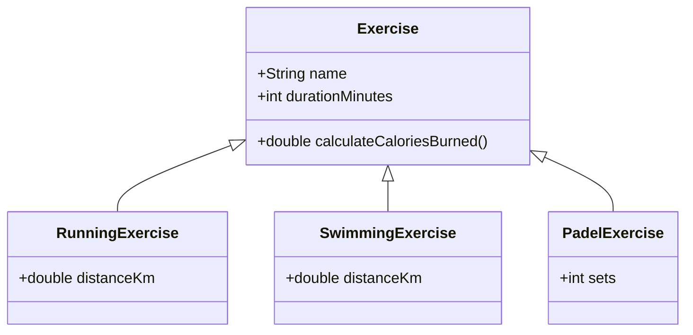

# Perintä ja rajapinnat
{: .no_toc }

Perintä (inheritance) ja rajapinnat (interfaces) ovat olio-ohjelmoinnin ratkaisuja koodin uudelleenkäytettävyyden ja yhteensopivuuden edistämiseksi.
{: .fs-6 }

---

## Tällä sivulla:
{: .no_toc .text-delta }

* Sisällysluettelo
{:toc}

Jos esimerkiksi netin kauppapaikalla on myynnissä monenlaisia tuotteita esineistä asuntoihin ja ajoneuvoihin, voidaan kaikille tuotteille yhteiset ominaisuudet toteuttaa yhteen luokkaan, jota voidaan laajentaa tapauskohtaisten aliluokkien avulla. Näin vältetään toteuttamasta samoja yhteisiä ominaisuuksia moneen luokkaan. Samalla koodin yhteensopivuus paranee, kun aliluokkien oliot ovat yhteensopivia yliluokan olioiden kanssa. Perinnän avulla sekä autoja, asuntoja että muita tuotteita voidaankin tarvittaessa käsitellä esimerkiksi samalla listalla.

Perintää käytetään usein tilanteissa, joissa on olemassa jo jokin toteutus, jota halutaan laajentaa erityistapauksen avulla. Rajapintoja puolestaan käytetään usein tilanteissa, joissa selvää yhteistä toteutusta ei ole. Toisin kuin luokat, rajapinnat ovat abstrakteja, eli niistä ei voida luoda olioita. Rajapintojen avulla voidaan kuitenkin määritellä yksi tai useampia metodeja, jotka rajapinnan täyttävien luokkien on toteutettava.


## Perintä

> *"Perintä on väline käsitehierarkioiden rakentamiseen ja erikoistamiseen; aliluokka on aina yliluokan erikoistapaus. Jos luotava luokka on olemassaolevan luokan erikoistapaus, voidaan uusi luokka luoda perimällä olemassaoleva luokka. Esimerkiksi auton osiin liittyvässä esimerkissä moottori on osa, mutta moottoriin liittyy lisätoiminnallisuutta mitä jokaisella osalla ei ole."*
>
> Lähde: [Helsingin Yliopiston Agile Education Research –tutkimusryhmä. Perintä. mooc.fi](https://ohjelmointi-20.mooc.fi/osa-9/1-perinta)


### Perintä osa 1: [eri lähestymistavat tuotetietojen mallintamiseen](https://web.microsoftstream.com/video/788b9504-8600-4419-8e96-673ecd0a1ea2) <small>41:44</small>




Tällä videolla perehdymme siihen, minkälaisia hyötyjä perintä tarjoaa tiedon mallintamiseen. Esimerkkeinä käytämme verkkopalvelua, jossa on tarjolla laaja valikoima myynti-ilmoituksia asunnoista autoihin. Sekä autoilla että asunnoilla on omat attribuuttinsa (oliomuuttujat), mutta ne ovat silti yhteensopivia keskenään ja muiden ilmoitustyyppien kanssa perinnän kautta.

💡 Videon katsomiseksi sinun täytyy kirjautua sisään Microsoft Stream -palveluun Haaga-Helian käyttäjätunnuksellasi.

Videolla esiintyvät lähdekoodit löytyvät [gist.github.com-palvelusta](https://gist.github.com/swd1tn002/01ee568bd1ec63eab9e16743aec6772c).

### Perintä osa 2: [metodien ylikirjoittaminen](https://web.microsoftstream.com/video/10d75407-1851-44b6-b43c-d9401fa46160) <small>33:39</small>

Tällä videolla muodostamme eri tyyppisille ilmoituksille omat HTML-esityksensä ja ylikirjoitamme yliluokan metodeja eri aliluokkien tarpeet huomioiden. Sivuamme samalla myös for-each-toistorakennetta, `@Override`-annotaatiota ja monirivisiä merkkijonoja.

💡 Videon katsomiseksi sinun täytyy kirjautua sisään Microsoft Stream -palveluun Haaga-Helian käyttäjätunnuksellasi.

Videolla esiintyvät lähdekoodit löytyvät [gist.github.com-palvelusta](https://gist.github.com/swd1tn002/01ee568bd1ec63eab9e16743aec6772c).


### Perintä osa 3: [PowerPoint-esitys](https://video.haaga-helia.fi/media/Olio-ohjelmointiA+toisen+luokan+periminen/0_7kvfzdro) <small>10:41</small>

<iframe src="https://d38ynedpfya4s8.cloudfront.net/p/288/sp/28800/embedIframeJs/uiconf_id/23448708/partner_id/288?iframeembed=true&playerId=kaltura_player&entry_id=0_7kvfzdro&flashvars[streamerType]=auto&amp;flashvars[localizationCode]=en&amp;flashvars[leadWithHTML5]=true&amp;flashvars[sideBarContainer.plugin]=true&amp;flashvars[sideBarContainer.position]=left&amp;flashvars[sideBarContainer.clickToClose]=true&amp;flashvars[chapters.plugin]=true&amp;flashvars[chapters.layout]=vertical&amp;flashvars[chapters.thumbnailRotator]=false&amp;flashvars[streamSelector.plugin]=true&amp;flashvars[EmbedPlayer.SpinnerTarget]=videoHolder&amp;flashvars[dualScreen.plugin]=true&amp;flashvars[hotspots.plugin]=1&amp;flashvars[Kaltura.addCrossoriginToIframe]=true&amp;&wid=0_urm3ihed" width="608" height="402" allowfullscreen webkitallowfullscreen mozAllowFullScreen allow="autoplay *; fullscreen *; encrypted-media *" sandbox="allow-forms allow-same-origin allow-scripts allow-top-navigation allow-pointer-lock allow-popups allow-modals allow-orientation-lock allow-popups-to-escape-sandbox allow-presentation allow-top-navigation-by-user-activation" frameborder="0" title="Kaltura Player"></iframe>

Videolla esiintyvät [PowerPoint-kalvot löydät täältä](/kalvot/perinta-ja-rajapinnat.pdf).


### Exercise ja sen aliluokat



### Perintään liittyvät tehtävät (Viope)

Seuraavat tehtävät on lainattu Helsingin yliopiston mooc-kurssilta. Sinulle voi olla hyödyksi tutustua myös [HY:n oppimateriaaliin tästä aiheesta](https://ohjelmointi-20.mooc.fi/osa-9/1-perinta) tehtäviä ratkoessasi.

1. **Henkilö-tehtävä**

    Tässä tehtävässä kerrataan olio-ohjelmoinnin perusrakenteet (oliomuuttujat, konstruktori, metodit, toString) ja luodaan yliluokka, jota hyödynnetään seuraavissa tehtävissä.

    Mikäli olio-ohjelmointitaitosi ovat ruosteessa, voit kerrata olio-ohjelmoinnin peruskäsitteet [tätä tehtävää käsittelevän videon](https://video.haaga-helia.fi/media/Henkilo-luokka/0_xe1vpvfl) avulla.

1. **Opiskelija-tehtävä**

    Tässä tehtävässä harjoitellaan perimään valmis luokka ja toteutetaan aliluokkaan oma yksittäinen opintopisteet-ominaisuus.

    Tehtävän avuksi on tarjolla [videotallenne](https://video.haaga-helia.fi/media/Luokan+periminenA+Opiskelija-luokka/0_pwgch6v9).

1. **Opiskelijalle toString**

    Tässä tehtävässä harjoittelemme yliluokan ominaisuuksien ylikirjoittamista (override) sekä yliluokan metodien kutsumista aliluokasta.

1. **Henkilöiden tulostaminen**

    Tässä tehtävässä kokeilemme aikaisemmista tehtävistä tuttujen Opiskelija- ja Henkilö-olioiden yhteiskäyttöä samalla listalla ja saman tulostuslogiikan kanssa.

Tarkemmat tehtävänannot ja tehtäviä koskevat videotallenteet löydät [Viopesta](https://vw4.viope.com/).

Tehtävät on lainattu Helsingin Yliopiston Agile Education Research –tutkimusryhmän [oppimateriaalista](https://materiaalit.github.io/ohjelmointi-18/part10/), joka on lisensoitu [Creative Commons BY-NC-SA 4.0](https://creativecommons.org/licenses/by-nc-sa/4.0/deed.fi) -lisenssillä.


&nbsp;

---

## Rajapinnat

> *"Rajapinnan (engl. interface) avulla määritellään luokalta vaadittu käyttäytyminen, eli sen metodit. Rajapinnat määritellään kuten normaalit Javan luokat, mutta luokan alussa olevan määrittelyn "public class ..." sijaan käytetään määrittelyä "public interface ...". Rajapinnat määrittelevät käyttäytymisen metodien niminä ja palautusarvoina, mutta ne eivät aina sisällä metodien konkreettista toteutusta. Näkyvyysmäärettä rajapintoihin ei erikseen merkitä, sillä se on aina public."*
>
> Lähde: [Helsingin Yliopiston Agile Education Research –tutkimusryhmä. Rajapinta. mooc.fi](https://ohjelmointi-20.mooc.fi/osa-9/2-rajapinta)


### [Rajapinnat](https://video.haaga-helia.fi/media/Rajapinnat/0_aojswqwn) <small>7:43</small>

<iframe src="https://d38ynedpfya4s8.cloudfront.net/p/288/sp/28800/embedIframeJs/uiconf_id/23448708/partner_id/288?iframeembed=true&playerId=kaltura_player&entry_id=0_aojswqwn&flashvars[streamerType]=auto&amp;flashvars[localizationCode]=en&amp;flashvars[leadWithHTML5]=true&amp;flashvars[sideBarContainer.plugin]=true&amp;flashvars[sideBarContainer.position]=left&amp;flashvars[sideBarContainer.clickToClose]=true&amp;flashvars[chapters.plugin]=true&amp;flashvars[chapters.layout]=vertical&amp;flashvars[chapters.thumbnailRotator]=false&amp;flashvars[streamSelector.plugin]=true&amp;flashvars[EmbedPlayer.SpinnerTarget]=videoHolder&amp;flashvars[dualScreen.plugin]=true&amp;flashvars[hotspots.plugin]=1&amp;flashvars[Kaltura.addCrossoriginToIframe]=true&amp;&wid=0_jafkkkos" width="608" height="402" allowfullscreen webkitallowfullscreen mozAllowFullScreen allow="autoplay *; fullscreen *; encrypted-media *" sandbox="allow-forms allow-same-origin allow-scripts allow-top-navigation allow-pointer-lock allow-popups allow-modals allow-orientation-lock allow-popups-to-escape-sandbox allow-presentation allow-top-navigation-by-user-activation" frameborder="0" title="Kaltura Player"></iframe>

[PowerPoint-kalvot](/kalvot/perinta-ja-rajapinnat.pdf)

Huom! Oheisella videolla mainitaan rajapintojen lisäksi abstraktit luokat, jotka eivät kuulu tämän kurssitoteutuksen sisältöön.


### Tehtävä: Maat (Comparable-rajapinta)

Täydennä valmista `Country`-luokkaa siten, että luokka täyttää [Javan standardikirjaston valmiin `Comparable`-rajapinnan](https://docs.oracle.com/javase/8/docs/api/java/lang/Comparable.html).

Comparable-rajapinta on hyödyllinen esimerkiksi tapauksissa, joissa haluat määritellä oman luokkasi olioille järjestyksen:

> *"Lists (and arrays) of objects that implement this interface can be sorted automatically by Collections.sort (and Arrays.sort).*"
>
> [Java API. Comparable. oracle.com](https://docs.oracle.com/javase/8/docs/api/java/lang/Comparable.html)

Toteutettuasi tämän rajapinnan, voit siis esimerkiksi järjestää oman luokkasi oliot `Collections.sort`-metodilla tai etsiä niistä suurimman `Collections.max`-metodilla. Itse Comparable-rajapinnan lähdekoodi näyttää kutakuinkin seuraavalta:

```java
// Huom! Älä kopioi tätä itsellesi! Comparable löytyy Javasta valmiina!
public interface Comparable<T> {
    /**
     * https://docs.oracle.com/javase/8/docs/api/java/lang/Comparable.html
     *
     * @return a negative integer, zero, or a positive integer as
     *         this object is less than, equal to, or greater than
     *         the specified object.
     */
    int compareTo(T other);
}
```

Lähdekoodista näemme, että rajapintaan on määritetty ainoastaan yksi metodi: `compareTo`. Metodille on määritelty paluuarvo (int) sekä parametrimuuttuja, mutta itse metodin toteutus jää tätä rajapintaa hyödyntävän luokan toteutettavaksi.

Metodin dokumentaatiokommentin mukaisesti sen tulee palauttaa negatiivinen kokonaisluku, mikäli tämä Country-olio tulee järjestyksessä ensin. Vastaavasti metodin tulee palauttaa positiivinen kokonaisluku, mikäli parametrina annettu toinen olio on järjestyksessä ensin. Jos molemmat ovat saman suuruiset, metodin tulee palauttaa nolla.

Koska `Comparable` on ns. geneerinen tyyppi, sen lähdekoodissa esiintyy tyyppiparametri `<T>`. Käytännössä tyypitys tarkoittaa sitä, että toteuttaessasi rajapinnan määrittelet sille tyypiksi `<Contry>`:

```java
public class Country implements Comparable<Country> {

}
```
Tyyppiparametri `T` esiintyy myös rajapinnassa `compareTo`-metodin parametrin tyyppinä. Tyypitys on meille tuttua esimerkiksi listojen yhteydestä.

Kun luokkasi toteuttaa rajapinnan `Country`-tyypillä, toteutetaan `compareTo` myös tällä samalla tyypillä:

```java
public class Country implements Comparable<Country> {

    public int compareTo(Country other) {
        return 0; // TODO: vertaile maiden väkilukuja
    }
}
```

Maat tulee järjestää väkiluvun perusteella siten, että väkiluvultaan pienempi maa on järjestyksessä ennen väkiluvulta suurempaa maata. Hyvä lisämateriaali logiikan hahmottamiseksi on esimerkiksi [https://www.baeldung.com/java-comparator-comparable](https://www.baeldung.com/java-comparator-comparable).

Voit käyttää tehtävässä pohjana seuraavaa Country-luokkaa:

```java
public class Country implements Comparable<Country> {

    private final String name;
    private final int population;

    public Country(String name, int population) {
        this.name = name;
        this.population = population;
    }

    public String getName() {
        return name;
    }

    public int getPopulation() {
        return population;
    }

    @Override
    public String toString() {
        return this.name + ", population: " + this.population;
    }

    // TODO: toteuta compareTo-metodi tänne!
}
```

### Testaus ja käyttöliittymä

Tässä tehtävässä sinun ei tarvitse toteuttaa lainkaan käyttöliittymää omaan ohjelmaasi. Voit Testata ratkaisuasi erillisellä testiluokalla, jonka main-metodissa lisäät `Country`-olioita listalle ja järjestät listan. Yksi mahdollisuus järjestelylogiikan testaamiseksi on esim. seuraava `main`-metodi, jota käytetään koodin testaamisessa myös Viopessa:

```java
/*
 * Väkilukujen lähde: Wikipedia. https://en.wikipedia.org/wiki/Nordic_countries.
 * Luettu 23.3.2021.
 */
public static void main(String[] args) {
    Country d = new Country("Denmark", 5_809_502);
    Country f = new Country("Finland", 5_537_364);
    Country i = new Country("Iceland", 343_518);
    Country n = new Country("Norway", 5_372_191);
    Country s = new Country("Sweden", 10_313_447);

    List<Country> countries = Arrays.asList(d, f, i, n, s);
    Collections.sort(countries);

    for (Country c : countries) {
        System.out.println(c);
    }
}
```

Palauta lopuksi Country-luokkasi Viopeen.


### Ohjelmalogiikan automatisoidusta testaamisesta

Vaikka yllä oleva ratkaisu toivottavasti auttaa sinua ratkaisemaan tämän tehtävän, ohjelmistojen testaaminen `System.out.println`-metodin tulosteiden ja niiden manuaalisen läpikäynnin avulla on varsin työlästä. Vähänkään isomman ohjelman testeissä tulosteita olisi nopeasti satoja ellei tuhansia. Parempi tapa ohjelmistojen testaamiseen onkin ns. yksikkötestit, joihin perehdymme tämän kurssin seuraavissa vaiheissa.
