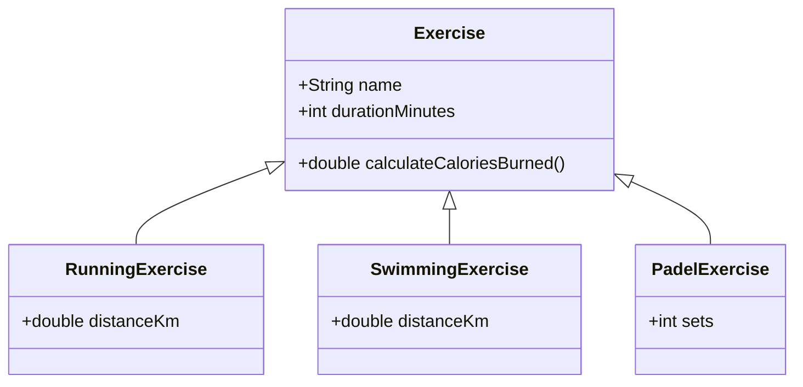

# Perintä ja rajapinnat
{: .no_toc }

Perintä (inheritance) ja rajapinnat (interfaces) ovat olio-ohjelmoinnin ratkaisuja koodin uudelleenkäytettävyyden ja yhteensopivuuden edistämiseksi. Interface määrittää metodin nimet, paluuarvot ja parametrit.
{: .fs-6 }

---

## Tällä sivulla:
{: .no_toc .text-delta }

* Sisällysluettelo
{:toc}

Jos esimerkiksi netin kauppapaikalla on myynnissä monenlaisia tuotteita esineistä asuntoihin ja ajoneuvoihin, voidaan kaikille tuotteille yhteiset ominaisuudet toteuttaa yhteen luokkaan, jota voidaan laajentaa tapauskohtaisten aliluokkien avulla. Näin vältetään toteuttamasta samoja yhteisiä ominaisuuksia moneen luokkaan. Samalla koodin yhteensopivuus paranee, kun aliluokkien oliot ovat yhteensopivia yliluokan olioiden kanssa. Perinnän avulla sekä autoja, asuntoja että muita tuotteita voidaankin tarvittaessa käsitellä esimerkiksi samalla listalla.

Perintää käytetään usein tilanteissa, joissa on olemassa jo jokin toteutus, jota halutaan laajentaa erityistapauksen avulla. Rajapintoja puolestaan käytetään usein tilanteissa, joissa selvää yhteistä toteutusta ei ole. Toisin kuin luokat, rajapinnat ovat abstrakteja, eli niistä ei voida luoda olioita. Rajapintojen avulla voidaan kuitenkin määritellä yksi tai useampia metodeja, jotka rajapinnan täyttävien luokkien on toteutettava.


## Perintä

> *"Perintä on väline käsitehierarkioiden rakentamiseen ja erikoistamiseen; aliluokka on aina yliluokan erikoistapaus. Jos luotava luokka on olemassaolevan luokan erikoistapaus, voidaan uusi luokka luoda perimällä olemassaoleva luokka. Esimerkiksi auton osiin liittyvässä esimerkissä moottori on osa, mutta moottoriin liittyy lisätoiminnallisuutta mitä jokaisella osalla ei ole."*
>
> Lähde: [Helsingin Yliopiston Agile Education Research –tutkimusryhmä. Perintä. mooc.fi](https://ohjelmointi-20.mooc.fi/osa-9/1-perinta)


Opetuskalvot [PowerPoint-kalvot löydät täältä](/kalvot/perinta-ja-rajapinnat.pdf).


### Exercise ja sen aliluokat



### Perintäesimerkki 

**Henkilo-luokka**
```java
package perinta;

public class Henkilo {
    private String etunimi;
    private String sukunimi;
    private String email;
    
    public Henkilo(String etunimi, String sukunimi, String email) {
        this.etunimi = etunimi;
        this.sukunimi = sukunimi;
        this.email = email;
    }

    public String getEtunimi() {
        return etunimi;
    }

    public String getSukunimi() {
        return sukunimi;
    }

    public String getEmail() {
        return email;
    }

    public void setEmail(String email) {
        this.email = email;
    }

    @Override
    public String toString() {
        return "Henkilo [etunimi=" + etunimi + ", sukunimi=" + sukunimi + ", email=" + email + "]";
    }
}

```

Henkilo-luokka sisältää henkilön perustietoja, jos ollaan tekemässä oppilaitoksen järjestelmään, tarvitaan vielä ainakin Opiskelija-luokka. Oppilaalla on nimi, sähköposti ja lisäksi opiskelijanumero ja aloitusvuosi (toki oikeasti paljon muitakin ominaisuuksia). Periytymisen avulla voidaan hyödyntää Henkilo-luokkaa Opiskelija-luokkaa määriteltäessä. Huomaa seuraavassa koodiesimerkissä varatut sanat **extends**, **super** ja annotaatio **@Override**. 

```java
package perinta;

public class Opiskelija extends Henkilo {
    private String opiskelijanumero;
    private int aloitusvuosi;
    
    public Opiskelija(String etunimi, String sukunimi, String email, String opiskelijanumero, int aloitusvuosi) {
        super(etunimi, sukunimi, email);
        this.opiskelijanumero = opiskelijanumero;
        this.aloitusvuosi = aloitusvuosi;
    }

    public String getOpiskelijanumero() {
        return opiskelijanumero;
    }

    public int getAloitusvuosi() {
        return aloitusvuosi;
    }
  
    @Override
    public String toString() {
        return super.toString() +  " Opiskelija [opiskelijanumero=" + opiskelijanumero + ", aloitusvuosi=" + aloitusvuosi + "]";
    }
}
```

Henkilo-luokka on yliluokka (yläluokka, super class), käytetään myös termiä kantaluokka (base class). Opiskelija-luokka on aliluokka (sub class) tai johdettu luokka (derived class). Opiskelija-luokka perii kaikki kentät ja metodit kantaluokalta, periminen määritellään extends sanalla. **Luokka voi periä vain yhden luokan**, moniperiytyminen on estetty Java-kielessä. Luokka voi toteuttaa useita rajapintoja. Moniperiytyminen on tarkoituksellisesti jätetty pois Java-kielestä, sen hallitsematon käyttö aiheuttaa enemmän ongelmia kuin tuo hyötyjä, lisäksi rajoituksen voi käytännössä kiertää rajapintojen avulla.

Opiskelija-luokassa huomaa miten aliluokassa käytetään hyväksi yliluokan konstruktoria (super(etunimi, sukunimi, email);) sekä toString-metodissa super.toString(). Super viittaa aina kantaluokkaan. Kontruktorissa kantaluokan konstruktorin kutsuminen super-määrittelyllä on pakko olla ensimmäinen lause.

Henkilo-luokassa on määritelty toString()-metodi. Metodit voidaan ylikirjoittaa aliluokissa, tässä esimerkissä tulostataan nimen lisäksi opiskelijanumero ja aloitusvuosi. Ylikirjoitus on syytä toteuttaa käyttämällä @Override-annotaatiota.

Lisätään vielä Opettaja-luokka:
```java
package perinta;

public class Opettaja extends Henkilo {
    private String opettajaprivate numero;

    public Opettaja(String etunimi, String sukunimi, String email, String opettajanumero) {
        super(etunimi, sukunimi, email);
        this.opettajanumero = opettajanumero;
    }

    public String getOpettajanumero() {
        return opettajanumero;
    }

    @Override
    public String toString() {
        return super.toString() + "Opettaja [opettajanumero=" + opettajanumero + "]";
    }
}
```
Sekä opettaja että opiskelija sisältävät nimen ja sähköpostiosoitteen. Näiden lisäksi molemmilla aliluokilla on jotain omina ominaisuuksia. Koska molemmilla on sama yliluokka, voidaan niitä käsitellä täysin samalla tavalla. Tehdään vaikka pieni koodipätkä, jolla tehdään lista opettajista ja oppilaista, jotka osallistuvat ohjattuun taukojumppaan. 
```java
List<Henkilo> osallistujat = new ArrayList<>();
osallistujat.add(new Opettaja("Teemu", "Terävä", "tt@hotmail.com", "h1234"));
osallistujat.add(new Opiskelija("Olivia", "Ahkera", "b987@hh.fi", "b987", 2018));
osallistujat.add(new Opiskelija("Olli", "Oppilas", "b123@hh.fi", "b123", 2023));
osallistujat.add(new Opettaja("Jukka", "Nokkela", "juno@gmail.com", "h9876"));

System.out.println("Taukotilaisuuteen osallistujat: ");
for (Henkilo h : osallistujat) {
    System.out.println(h);
}
```
Aikaisemmin toString()-metodiin liitetty @Overide-annotaatio ei ole (aivan) pakollinen, mutta sitä kannattaa käyttää. Sen avulla kääntäjä voi tarkistaa että kantaluokassa on varmasti olemassa ylikirjoitettava metodi, kääntäjä voi tehdä optimointia sekä dokumentoidaan koodin ylläpitäjälle ylikirjoituksesta. Muutoin koodia luettaessa ei pysty päättelemään pelkästä metodista, onko kyseessä ylikirjoitus vai ei.
&nbsp; 

Jossain tilanteissa pitää pystyä selvittämään suorituksen aikana muuttujan tyyppi. Tähän voi käyttää Java-kielessä instanceof -operaattoria.
```java
if (hlo instanceof Opettaja) {
    // hlo-muuttuja on Opettaja-luokan instanssi
} 
else {
    // jostain muusta luokasta on kysymys
}
```
instanceof-operaattorin lisäksi suorituksen aikana voi olion tyyppitiedon kysyä getClass()-funktiolla. Funktio palauttaa T-olion, joka sisältää luokan tyyppitiedon, esimerkiksi luokan nimen tai mitä rajapintoja olio toteuttaa.
```java
String luokanNimi = hlo.getClass().getName();
```
---

## Rajapinnat

> *"Rajapinnan (engl. interface) avulla määritellään luokalta vaadittu käyttäytyminen, eli sen metodit. Rajapinnat määritellään kuten normaalit Javan luokat, mutta luokan alussa olevan määrittelyn "public class ..." sijaan käytetään määrittelyä "public interface ...". Rajapinnat määrittelevät käyttäytymisen metodien niminä ja palautusarvoina, mutta ne eivät aina sisällä metodien konkreettista toteutusta. Näkyvyysmäärettä rajapintoihin ei erikseen merkitä, sillä se on aina public."*
>
> Lähde: [Helsingin Yliopiston Agile Education Research –tutkimusryhmä. Rajapinta. mooc.fi](https://ohjelmointi-20.mooc.fi/osa-9/2-rajapinta)


### [Rajapinnat]

[PowerPoint-kalvot](/kalvot/perinta-ja-rajapinnat.pdf)
