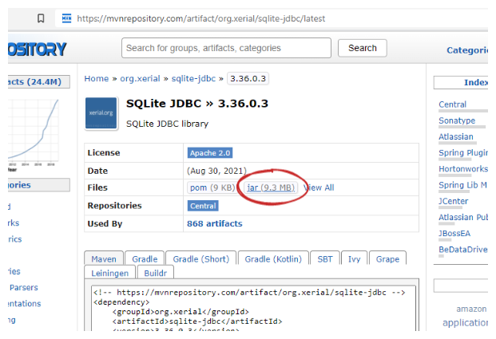

# Tietokantaohjelmointi

<link href="/styles.css" rel="stylesheet">

[⇦ takaisin kurssin etusivulle](../)


Tällä viikolla opettelemme ensin muodostamaan yhteyden tietokantaan Java-ohjelmasta käsin ja tekemään yksinkertaisia CRUD-toimenpiteitä (Create, Read, Update & Delete). Tutustumme mm. käsitteisiin JDBC ja PreparedStatement.

**Huom!** Materiaalissa olevien videoiden katsomiseksi sinun täytyy kirjautua sisään Microsoft Stream -palveluun Haaga-Helian käyttäjätunnuksellasi.


## JDBC – Java Database Connectivity

Javan standardikirjastoon määritelty JDBC (Java Database Connectivity) -ohjelmointirajapinta mahdollistaa Java-sovellusten yhdistämisen eri tyyppisiin SQL-tietokantoihin ja erilaisten kyselyiden sekä päivitysten tekemisen Java-koodista käsin. 

JDBC ei rajoita sitä, minkä SQL-pohjaisten tietokantojen kanssa sitä voidaan käyttää, vaan eri tietokantoja voidaan hyödyntää käyttämällä niille toteutettuja valmiita ajureita. Sillä ei siis Java-koodisi näkökulmasta ole eroa, käytätkö tietokantana esimerkiksi [MySQL](https://www.mysql.com/)-, [PostgreSQL](https://www.postgresql.org/)- vai [SQLite](https://www.sqlite.org/index.html)-tyyppistä tietokantaa. Tällä kurssilla hyödynnämme **SQLite**-tietokantoja niiden tiedostopohjaisuuden ja helppokäyttöisyyden vuoksi.


## SQLite

SQLite-tietokanta on paikallinen muisti- tai tiedostopohjainen tietokanta, joka ei vaadi erillistä palvelinta, vaan se voidaan "sulauttaa" osaksi omaa sovellustamme:

> *"In contrast to many other database management systems, SQLite is not a client–server database engine. Rather, it is embedded into the end program."*
> 
> *"SQLite is a popular choice as embedded database software for local/client storage in application software such as web browsers. It is arguably the most widely deployed database engine, as it is used today by several widespread browsers, operating systems, and embedded systems (such as mobile phones), among others. SQLite has bindings to many programming languages.*"
>
> [https://en.wikipedia.org/wiki/SQLite](https://en.wikipedia.org/wiki/SQLite)

SQLite toimii Java-ohjelman näkökulmasta samalla tavalla kuin erilliset tietokantapalvelimet. Myös SQL-kyselyt ovat pääosin samat, esimerkiksi `SELECT id, name FROM Person`.

SQLiten kanssa emme tarvitse erillistä tietokantapalvelinta, joten meidän ei tarvitse huolehtia verkkoyhteyksistä tai salasanoista. SQLite ei myöskään edellytä asennuksia, vaan riittää, että lisäämme SQLite-ajurin Java-projektiimme. Tämän viikon oppimistavoitteisiin kuuluvatkin ajurin käyttöönotto, tietokantaan yhdistäminen sekä ensimmäiset Java-koodista tehtävät SQL-kyselyt.

Toteutamme tällä kurssilla tietokantalogiikan Java-koodeissamme siten, että samat koodirivit toimisivat esim. MySQL tai MariaDB –tietokantoja hyödyntäen. Tietokannan vaihtaminen olisi myöhemmin Java-koodin kannalta suoraviivaista: sinun tulisi vain vaihtaa uusi tietokanta-ajuri ja yhteysosoitteet, joita käsitellään seuraavissa kappaleissa.

<!-- Suorituskyvyn puolesta SQLite ei olisi hyvä valinta julkisen web-järjestelmän tietokannaksi. SQLite soveltuu kuitenkin erinomaisesti moniin erilaisiin tarpeisiin ja esimerkiksi lukuisat mobiilisovellukset ja nettiselaimet käyttävät SQLite:ä paikallisena tietokantanaan. -->

## Video 1: [JDBC ja SQLite](https://web.microsoftstream.com/video/4906ef8a-22f3-4322-9673-df55481b3624) <small>8:12</small>

<iframe width="640" height="360" src="https://web.microsoftstream.com/embed/video/4906ef8a-22f3-4322-9673-df55481b3624?autoplay=false&amp;showinfo=true" allowfullscreen style="border:none;"></iframe>

Tällä videolla esitellään JDBC-teknologian perusidea ja käsitteistöä ja valmistellaan Eclipse-projekti tietokantaohjelmointia varten.

Videolla esiintyvän ajurin latauslinkki: [https://mvnrepository.com/artifact/org.xerial/sqlite-jdbc/latest](https://mvnrepository.com/artifact/org.xerial/sqlite-jdbc/latest)

Videolla esiintyvä [PowerPoint-esitys on ladattavissa tästä](./jdbc.pdf).


&nbsp;


## JDBC:n SQLite-ajuri

Tietokannan käyttämiseksi Javasta käsin tarvitsemme erillisen JDBC-ajurin. Erilliset Java-kirjastot jaellaan tyypillisesti `.jar`-tiedostoina (Java Archive), jotka asennetaan pääsääntöisesti automaatiotyökalujen avulla. Suosituimpia automaatiotyökaluja Javalle ovat [Maven](https://maven.apache.org/) ja [Gradle](https://gradle.org/). Automaatiotyökalujen avulla monimutkaistenkin riippuvuuksien hallinta on kohtuullisen yksinkertaista ja myös Eclipsessä on hyvät integraatiota automaatiotyökalujen hyödyntämiseksi.

Jotta kurssilla ei tulisi kerralla liikaa uusia työkaluja, haemme tarvittavan ajurin manuaalisesti Mavenin tietovarastosta. Myöhemmin kurssilla opettelemme lisäämään saman ajurin projektiimme Mavenin avulla.


**Ajurin tallentaminen**

Siirry Maven-repositorioon osoitteeseen [https://mvnrepository.com/artifact/org.xerial/sqlite-jdbc/latest](https://mvnrepository.com/artifact/org.xerial/sqlite-jdbc/latest). Tallenna ajuri itsellesi linkistä "Jar (x MB)":




**Ajurin lisääminen Eclipse-projektiin**

Ajurin käyttöönotto projektissasi edellyttää sen lisäämistä projektin "build path":iin. Build path on lista sijainneista, joissa ohjelmasi käyttämät Java-luokat sijaitsevat. Ajurin lisääminen onnistuu helpoiten seuraavasti:

1. luo projektiisi uusi hakemisto, esim. `lib`
2. siirrä edellä tallentamasi `sqlite-jdbc-x.y.z.jar`-tiedosto luomaasi uuteen hakemistoon
3. lisää lib-hakemisto projektisi "build path":iin [tämän Stack Overflow -viestin mukaisesti](https://stackoverflow.com/a/23420543).

⚠️ **Huom!** Jar-tiedostot sisältävät suoritettavaa ohjelmakoodia, joten niiden kanssa tulee huomioida tietoturva, aivan kuten muidenkin suoritettavien ohjelmien kanssa. Jar-paketteja ei kannata ladata tuntemattomista lähteistä. Tunnettujen ja laajasti käytettyjen pakettien käyttäminen voi myös olla turvallisempaa kuin heikommin tunnettujen tai vähäisessä käytössä olevien. Lisätietoja löydät esimerkiksi [Google-haulla "Is Maven Safe?"](https://www.google.com/search?q=is+maven+safe)


## Video 2: [SQLite tools ja uuden tietokannan luominen](https://web.microsoftstream.com/video/9735fb55-5e0c-4d7d-bc03-bb72bd1097a1) <small>8:38</small>

<iframe width="640" height="360" src="https://web.microsoftstream.com/embed/video/9735fb55-5e0c-4d7d-bc03-bb72bd1097a1?autoplay=false&amp;showinfo=true" allowfullscreen style="border:none;"></iframe>

Tällä videolla valmistellaan tietokanta, jota käytetään seuraavaksi Java-ohjelmasta käsin.

Videolla käytettävän valinnaisen komentorivityökalun latauslinkki: [https://sqlite.org/download.html](https://sqlite.org/download.html)

Videolla esiintyvä SQLite tools -komentorivityökalun ohjesivu ["Extra: komentorivityökalun käyttö"](./komentorivityokalu).

Voit ladata videolla luotavan tietokantatiedoston itsellesi tästä: [shoppingList.sqlite](https://github.com/ohjelmointi2/ohjelmointi2.github.io/blob/main/sql/shoppingList.sqlite?raw=true). Tallenna tiedosto johonkin hakemistoon, jonka osoite on helposti kopioitavissa Java-koodiisi (esim. `C:\sqlite\shoppingList.sqlite` tai `/home/omanimi/sqlite/shoppingList.sqlite`).

&nbsp;

**Mahdollinen virhetilanne: ClassNotFoundException**

Mikäli hyödynnät Java-projektissasi [Javan moduulijärjestelmää](https://www.oracle.com/corporate/features/understanding-java-9-modules.html), eli valitsit Eclipsessä projektia luotaessasi vaihtoehdon **"Create a new module-info.java file"**, tulee sinun lisätä projektisi `module-info.java`-tiedostoon seuraavat uudet rivit:

```java
module oman_moduulisi_nimi_tassa {
    requires sqlite.jdbc;
    requires java.sql;
}
```

Moduulijärjestelmä muuttaa Javan tapaa ladata luokkia, joten käyttäessäsi `module-info.java`-tiedostoa seuraava kurssin esimerkeissä esiintyvä rivi aiheuttaa todennäköisesti poikkeuksen:

```java
Class.forName("org.sqlite.JDBC");
```

Ratkaisuna ongelmaan voit joko jättää yllä mainitun rivin pois koodista, tai poistaa projektistasi `module-info.java`- sekä `package-info.java`-tiedostot. Kurssin esimerkeistä `module-info.java`- ja `package-info.java` on poistettu.


### SQLite-tietokannan käyttäminen Javan ulkopuolelta (valinnainen)

Tietokannan käyttäminen Java-ohjelmasi ulkopuolella ei ole tällä kurssilla välttämätöntä, mutta kyselyitä on helpompi suunnitella ja kokeilla ennen niiden koodaamista osaksi ohjelmaa. Tietokannan luonti on myös kätevämpää tehdä erillisellä työkalulla, eikä itse Java-ohjelmassa.

[Erilaisten graafisten käyttöliittymien](https://www.google.com/search?q=sqlite+gui) (gui, Graphical User Interface) lisäksi SQLite:lle on saatavissa SQLite:n oma komentorivityökalu.

Voit ladata itsellesi kyseisen `sqlite3.exe`-komentorivityökalun osoitteesta [https://sqlite.org/download.html](https://sqlite.org/download.html). Työkalut löytyvät esimerkiksi Windowsille otsikon "Precompiled Binaries for Windows" alta (sqlite-tools-win32-x86-VERSIO.zip). Pura `sqlite3.exe`-tiedosto zip-paketista esimerkiksi samaan kansioon tietokantasi kanssa. Jos käytät eri käyttöjärjestelmää, sovella ohjeita oman käyttöjärjestelmäsi työkaluversion mukaisesti.

[Tällä sivulla](./komentorivityokalu) on esimerkki SQLite-komentorivityökalun käyttämisestä tämän kurssin harjoitustyötietokannan kanssa. Lisää ohjeita löydät SQLiten omilta sivuilta osoitteesta [https://sqlite.org/cli.html](https://sqlite.org/cli.html) ja alla olevista videoista.

<!--[](https://video.haaga-helia.fi/media/SQLite+tools/0_pez4r54j)

[SQLite tools -komentorivityökalun käyttöohje](https://video.haaga-helia.fi/media/SQLite+tools/0_pez4r54j)-->


## Video 3: [Tietokantaan yhdistäminen ja kyselyn tekeminen](https://web.microsoftstream.com/video/581f69fe-9594-4488-b841-e44954f303f2) <small>27:52</small>

<iframe width="640" height="360" src="https://web.microsoftstream.com/embed/video/581f69fe-9594-4488-b841-e44954f303f2?autoplay=false&amp;showinfo=true" allowfullscreen style="border:none;"></iframe>

Tällä videolla esitellään Javan luokat, joita tarvitset tietokantayhteyksien ja -kyselyiden muodostamiseksi. 

Videolla valmistuvan lähdekooditiedoston `TietokantaanYhdistaminen.java` löydät [täältä](./videoiden_lahdekoodit). Videolla esiintyvä [PowerPoint-esitys on ladattavissa tästä](./jdbc.pdf).

&nbsp;


## SQLite-tietokannan yhteysosoite

Muodostaessasi yhteyden tietokantaan `DriverManager.getConnection(url)`-metodin avulla, tulee sinun antaa parametrina merkkijono, joka on tietokanta-ajurikohtainen "connection url". JDBC-yhteysosoitteet alkavat aina etuliitteellä `jdbc:` ja ajurin nimellä. Ajurin nimen jälkeen kirjoitetaan kaksoispiste, ja sen jälkeen esimerkiksi tietokannan sijainti levyllä (esim. SQLite) tai verkossa (esim. MySQL).

SQLite-tietokannalle yhteysosoite on käyttöjärjestelmästä riippuen joko muodossa `jdbc:sqlite:C:\polku\tietokanta.sqlite` tai `jdbc:sqlite:/users/me/database.sqlite`. Kun kirjoitat SQLite-osoitteen Java-merkkijonoksi, huomaa, että kenoviivat (`\`) ovat [Javassa varattu erikoismerkeille](https://docs.oracle.com/javase/tutorial/java/data/characters.html). Tavallisen kenoviivan tuottamiseksi merkkijonoon kirjoitetaan siksi kaksi kenoviivaa (`"\\"`).

Java-koodissasi yhteys tietokantaan `C:\sqlite\shoppingList.sqlite` määritellään siis käytännössä esimerkiksi näin:

```java
private static final String JDBC_URL = "jdbc:sqlite:C:\\sqlite\\shoppingList.sqlite";
```

MySQL-tietokantaan yhdistettäisiin vastaavasti esim. osoitteella `"jdbc:mysql://127.0.0.1:3306/shoppinglist"`. Tällöin sinun tulee myös [lisätä projektiisi MySQL-ajuri](https://www.mysql.com/products/connector/), aivan kuten lisäsimme aikaisemmin SQLite-ajurin.

*Kovakoodatut arvot, kuten yllä oleva yhteysosoite, eivät edusta hyvää ohjelmointityyliä, joten seuraavalla viikolla opettelemme siirtämään ns. kovakoodatun tietokannan osoitteen lähdekoodista ympäristömuuttujaan:*

```java
// tästä lisää seuraavalla viikolla:
private static final String JDBC_URL = System.getenv("JDBC_DATABASE_URL");
```


## Video 4: [Turvalliset parametrisoidut tietokantakyselyt: prepared statement](https://web.microsoftstream.com/video/ddf1432d-fc3e-4d34-9feb-9ec68701d57d) <small>15:37</small>

<iframe width="640" height="360" src="https://web.microsoftstream.com/embed/video/ddf1432d-fc3e-4d34-9feb-9ec68701d57d?autoplay=false&amp;showinfo=true" allowfullscreen style="border:none;"></iframe>

Tällä videolla käsittelemme SQL injektioita, jotka aiheuttavat merkittäviä tietoturvauhkia tietokantapohjaisille järjestelmille. Opimme valmistelemaan kyselyt siten, että haitallista syötettä ei käsitellä SQL-komentoina vaan normaalina tekstinä.

Älä koskaan muodosta SQL-kyselyitä käsin yhdistelemällä merkkijonoja, koska kyselyn teko merkkijonoja yhdistelemällä aiheuttaa mm. tietoturvaongelmia:

<pre class="highlight" style="border: solid red 2px; color: red;"><code>// Tietoturvaongelma: `name` saattaa sisältää haitallista SQL-koodia!
PreparedStatement statement = connection.prepareStatement("SELECT * FROM Artist WHERE Name = \"" + name + "\"");</code></pre>

Kun kyselyissä tarvitaan ajonaikaisesti muodostettavia parametreja, kuten id tai nimi, ne tulee asettaa paikalleen PreparedStatement-luokan metodeilla. PreparedStatement-luokan SQL-kyselyihin parametrien tilalle kirjoitetaan kysymysmerkit (?), joiden kohdille asetetaan set-metodeilla arvot:

```java
PreparedStatement statement = connection.prepareStatement("SELECT * FROM Artist WHERE Name = ?");
statement.setString(1, name);
```

Videolla esiintyvän lähdekooditiedoston `TietokantaanYhdistaminen.java` löydät [täältä](./videoiden_lahdekoodit).

&nbsp;


## Yhteyksien sulkeminen

> *"When you are done with using your Connection, you need to explicitly close it by calling its close() method in order to release any other database resources (cursors, handles, etc.) the connection may be holding on to.*
>
> *Actually, the safe pattern in Java is to close your ResultSet, Statement, and Connection (in that order) in a finally block when you are done with them."*
>
> Pascal Thivent. [Closing database connections in Java. StackOverflow.com](https://stackoverflow.com/questions/2225221/closing-database-connections-in-java/2225275#2225275)

Yhteyksien sulkeminen kannattaa tehdä `try`-lohkon jälkeisessä `finally`-lohkossa, jotta yhteydet tulevat varmasti suljetuksi, vaikka koodissa olisi tapahtunut poikkeus. Sulkeminen voidaan tehdä esimerkiksi seuraavasti:

```java
try {
   // tietokantaoperaatiot

} catch (SQLException e) {
   // poikkeusten käsittely

} finally {
   if (connection != null) {
         try {
            connection.close();
         } catch (SQLException e) {
            e.printStackTrace();
         }
   }

   if (statement != null) {
         try {
            statement.close();
         } catch (SQLException e) {
            e.printStackTrace();
         }
   }

   if (result != null) {
         try {
            result.close();
         } catch (SQLException e) {
            e.printStackTrace();
         }
   }
}
```

Resurssien sulkeminen tulee tehdä kaikissa niissä metodeissa, joissa käytät tietokantayhteyksiä. Yllä olevan **koodin toistaminen monessa eri paikassa ei ole tyylikästä**, joten harkitse erillisen metodin toteuttamista, esimerkiksi seuraavasti:

```java
try {
   // tietokantaoperaatiot

} catch (SQLException e) {
   // poikkeusten käsittely

} finally {
   // toteuta itsellesi closeAll-metodi, ja kutsu sitä eri metodeista:
   closeAll(connection, statement, result);
}
```

Toinen vaihtoehto yhteyksien sulkemisen suoraviivaistamiseksi on Javan Try with resources -syntaksi, jota käsitellään seuraavaksi.

### Try with resources (valinnainen)

Javassa on olemassa lisäksi [try-with-resources](https://docs.oracle.com/javase/tutorial/essential/exceptions/tryResourceClose.html) -niminen rakenne, joka huolehtii automaattisesti siinä määriteltyjen resurssien sulkemisesta, eli niiden `close()`-metodin kutsumisesta lohkon jälkeen. 

Rakenne on syntaktisesti hieman muita tuntemiamme rakenteita hankalampi hahmottaa eikä se ole osa ohjelmointi 2:n oppimistavoitteita. Voit halutessasi lukea lisää try-with-resources -rakenteesta ja katsoa siihen liittyvät esimerkit [tällä erillisellä sivulla](./try-with-resources).


## Lisämateriaali

[Jenkov.com](http://tutorials.jenkov.com/jdbc/index.html) -palvelussa on laaja tutoriaali JDBC-teknologioista ja se käsittelee kattavasti tietokantojen Javasta käyttämiseksi tarvittavat toimenpiteet. Tutoriaali itsessään käyttää H2-tietokantaa, mutta ei tietokanta-ajurin luokan nimeä ja yhteysosoitetta lukuun ottamatta poikkea SQLite:n käytöstä:

[http://tutorials.jenkov.com/jdbc/index.html](http://tutorials.jenkov.com/jdbc/index.html)

Jenkov.com:in tutoriaalissa H2-tietokannan ajuri ladataan kirjoittamalla koodirivi `Class.forName("org.h2.Driver");`. Ajurin lataus manuualisesti ei usein ole erikseen tarpeellista, mutta vastaava rivi SQLite-tietokannan ajurin lataamiseksi on:

```java
Class.forName("org.sqlite.JDBC");
```

Jenkov.com:in tutoriaalin lisäksi myös Oraclella on [kattava oppimateriaali](https://docs.oracle.com/javase/tutorial/jdbc/basics/index.html) JDBC:n opetteluun. 

[https://docs.oracle.com/javase/tutorial/jdbc/basics/index.html](https://docs.oracle.com/javase/tutorial/jdbc/basics/index.html)

Hyviä ohjeita löytyy myös YouTubesta sekä Googlettamalla tarkemmin yksittäisiä JDBC-aiheita.

&nbsp;

## Tehtävä: tietokantapohjainen ostoslistasovellus JDBC:llä

Tällä viikolla sinun tulee toteuttaa Java-ohjelma, joka toimii käyttöliittymänä ostoslistan tuotteita sisältävälle tietokannalle. Tietokannassa on vain yksi taulu eikä sinun tarvitse huolehtia esimerkiksi siitä, voisiko ohjelmassa olla samanaikaisesti useita eri käyttäjien ostoslistoja. 

Tämän tehtävän ratkaisemiseksi sinulle voi olla hyödyllistä tutustua myös sovelluksen käyttöliittymää ja toimintalogiikkaa selostavaan videoon ["ShoppingListApp-sovelluksen ensimmäinen vaihe"](https://web.microsoftstream.com/video/8efb239a-4700-444a-a4a8-f6ef9bac10e9). 


### Ostoslista ja CRUD-operaatiot

Käyttöliittymän kautta tulee voida tehdä CRUD-operaatiot tietojen päivittämistä lukuun ottamatta (Create, Read, ~~Update~~ & Delete).

Ostoslistan sisällöksi riittää kutakin tuoteriviä kohden yksilöllinen `id` sekä ostettavan tuotteen nimi (`title`). Voit hyödyntää tässä tehtävässä valmista [SQLite-tietokantatiedostoa](https://github.com/ohjelmointi2/ohjelmointi2.github.io/blob/main/sql/shoppingList.sqlite?raw=true), johon on ajettu seuraava luontikäsky ja muutama esimerkkirivi:

```sql
CREATE TABLE ShoppingListItem (
   id INTEGER PRIMARY KEY,
   title TEXT NOT NULL
);
```

Valmiin tietokantatiedoston voit ladata itsellesi [tästä](https://github.com/ohjelmointi2/ohjelmointi2.github.io/blob/main/sql/shoppingList.sqlite?raw=true). Tallenna tiedosto johonkin hakemistoon, jonka osoite on helposti kopioitavissa Java-koodiisi (esim. `C:\sqlite\shoppingList.sqlite` tai `/home/omanimi/sqlite/shoppingList.sqlite`).

Varmista myös, että olet varmasti ladannut edellä [olevan ohjeistuksen mukaisesti](#jdbcn-sqlite-ajuri) SQLite-ajurin ja olet sijoittanut sen lib-kansioon, joka on projektisi build pathissa. 


### SQL-kyselyiden tietoturva

Huomaa, että SQL-kyselyjen muodostaminen merkkijonoja yhdistelemällä aiheuttaa mm. tietoturvaongelmia, kuten alla oleva esimerkki havainnollistaa:

[](https://xkcd.com/327/)

*Kuva: Randall Munroe. Exploits of a Mom. [https://xkcd.com/327/](https://xkcd.com/327/). [CC BY-NC 2.5](https://creativecommons.org/licenses/by-nc/2.5/)*

Muista siis käyttää oppimateriaaleissa esiteltyä `PreparedStatement`-luokkaa aina muodostaessasi kyselyitä, joihin syötetään dynaamisesti parametreja!


### Rivien poistaminen

Tässä tehtävässä ostoslistan rivien poistaminen voidaan tehdä SQL: `delete`-komennolla rivin `title`-arvon perusteella, esim:

```sql
DELETE FROM ShoppingListItem WHERE title = ?
```

Tämä käytäntö poistaa annetun merkkijonon perusteella ei ole yhtä "turvallinen" kuin esimerkiksi poisto pääavaimen perusteella. Jos poiston vaikutusta halutaan rajoittaa, SQL-kyselyyn voidaan laittaa esimerkiksi rajoite `LIMIT 1`. Näin poisto ei kohdistu useampaan kuin yhteen riviin kerrallaan. 

Tuotantokäytössä olevissa sovelluksissa poistamisen sijaan usein tehdään "soft delete" tai arkistointi, eli rivi merkitään poistetuksi, mutta sitä ei poisteta oikeasti. Tästä on esim. hyvä artikkeli ["Database design practice: soft-deletion, data archive, to delete or not to delete"](https://transang.me/database-design-practice-soft-deletion-to/).


### Esimerkkikäyttöliittymä

Tämän tehtävän kannalta ei ole oleellista, minkälaisen käyttöliittymän rakennat, kunhan sen kautta pystyy käyttämään tietokantaa ja näkemään tehtyjen muutosten vaikutukset.

Ohjelman esimerkkikäyttöliittymästä on [erillinen ohjedokumentti](./ostoslista-kayttoliittyma). Voit toteuttaa ohjelmasi omien mieltymystesi mukaan tai noudattaa seuraavan esimerkkisovelluksen toiminnallisuuksia:

```
Welcome to the shopping list app!
Available commands:
 list
 add [product name]
 remove [product name]
 quit

> list

Shopping list contents:
(1) Milk

> add Eggs

Successfully added Eggs

> list

Shopping list contents:
(1) Milk
(2) Eggs

> add Bread

Successfully added Bread

> remove Eggs

Succesfully removed Eggs

> list

Shopping list contents:
(1) Milk
(3) Bread

> remove Cookies

Could not remove Cookies

> foobar

Unknown command "foobar".

> quit

Bye!

```

Yllä esitetyn käyttöliittymän teknisen toteutuksen tueksi on kirjoitettu [oma ohjeistuksensa](./ostoslista-kayttoliittyma).

----

## Tehtävän palauttaminen

Palauta kaikki tehtävissä kirjoittamasi **lähdekoodit** Teamsiin määräaikaan mennessä. Palauta tiedostot yksittäin, eli ei pakattuna. Älä palauta tietokantaa äläkä ajuria.

Ratkaisusi ei tarvitse olla laajuudeltaan tai toimivuudeltaan täydellinen, vaan myös osittain toimivat ratkaisut arvostellaan. Osittain ratkaistut palautukset arvostellaan suhteessa niiden toimivuuteen ja valmiusasteeseen. Muista myös, että voit pyytää apua tehtävässä kohtaamiisi ongelmiin Teamsissa!

<script src="/scripts.js"></script>