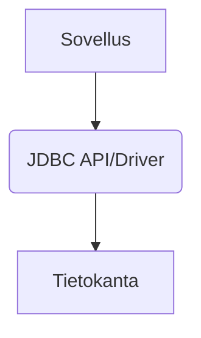

# Tietokantaohjelmointi
{: .no_toc }

Tällä viikolla opettelemme ensin muodostamaan yhteyden tietokantaan Java-ohjelmasta käsin ja tekemään yksinkertaisia CRUD-toimenpiteitä (Create, Read, Update & Delete). Tutustumme mm. käsitteisiin JDBC ja PreparedStatement. 
{: .fs-6 }

---

## Tällä sivulla:
{: .no_toc .text-delta }

* Sisällysluettelo
{:toc}

## JDBC – Java Database Connectivity

Javan standardikirjastoon määritelty JDBC (Java Database Connectivity) -ohjelmointirajapinta mahdollistaa Java-sovellusten yhdistämisen eri tyyppisiin SQL-tietokantoihin ja erilaisten kyselyiden sekä päivitysten tekemisen Java-koodista käsin.
 


JDBC ei rajoita sitä, minkä SQL-pohjaisten tietokantojen kanssa sitä voidaan käyttää, vaan eri tietokantoja voidaan hyödyntää käyttämällä niille toteutettuja valmiita ajureita. Sillä ei siis Java-koodisi näkökulmasta ole eroa, käytätkö tietokantana esimerkiksi [MySQL](https://www.mysql.com/)-, [PostgreSQL](https://www.postgresql.org/)- vai [SQLite](https://www.sqlite.org/index.html)-tyyppistä tietokantaa. Tällä kurssilla hyödynnämme oletuksena **SQLite**-tietokantoja niiden tiedostopohjaisuuden ja helppokäyttöisyyden vuoksi.


## SQLite

SQLite-tietokanta on paikallinen muisti- tai tiedostopohjainen tietokanta, joka ei vaadi erillistä palvelinta, vaan se voidaan "sulauttaa" osaksi omaa sovellustamme:

> *"In contrast to many other database management systems, SQLite is not a client–server database engine. Rather, it is embedded into the end program."*
>
> *"SQLite is a popular choice as embedded database software for local/client storage in application software such as web browsers. It is arguably the most widely deployed database engine, as it is used today by several widespread browsers, operating systems, and embedded systems (such as mobile phones), among others. SQLite has bindings to many programming languages.*"
>
> [https://en.wikipedia.org/wiki/SQLite](https://en.wikipedia.org/wiki/SQLite)

SQLite toimii Java-ohjelman näkökulmasta samalla tavalla kuin erilliset tietokantapalvelimet. Myös SQL-kyselyt ovat pääosin samat, esimerkiksi `SELECT id, name FROM Person`.

SQLiten kanssa emme tarvitse erillistä tietokantapalvelinta, joten meidän ei tarvitse huolehtia verkkoyhteyksistä tai salasanoista. SQLite ei myöskään edellytä asennuksia, vaan riittää, että lisäämme SQLite-ajurin Java-projektiimme. Tämän viikon oppimistavoitteisiin kuuluvatkin ajurin käyttöönotto, tietokantaan yhdistäminen sekä ensimmäiset Java-koodista tehtävät SQL-kyselyt.

Toteutamme tällä kurssilla tietokantalogiikan Java-koodeissamme siten, että samat koodirivit toimisivat esim. MySQL tai MariaDB –tietokantoja hyödyntäen. Tietokannan vaihtaminen olisi myöhemmin Java-koodin kannalta suoraviivaista: sinun tulisi vain vaihtaa uusi tietokanta-ajuri ja yhteysosoitteet, joita käsitellään seuraavissa kappaleissa.

<!-- Suorituskyvyn puolesta SQLite ei olisi hyvä valinta julkisen web-järjestelmän tietokannaksi. SQLite soveltuu kuitenkin erinomaisesti moniin erilaisiin tarpeisiin ja esimerkiksi lukuisat mobiilisovellukset ja nettiselaimet käyttävät SQLite:ä paikallisena tietokantanaan. -->


[PowerPoint-esitys on ladattavissa tästä](/kalvot/jdbc.pdf).


## JDBC:n SQLite-ajuri

Tietokannan käyttämiseksi Javasta käsin tarvitsemme erillisen JDBC-ajurin. Erilliset Java-kirjastot jaellaan tyypillisesti `.jar`-tiedostoina (Java Archive), jotka asennetaan pääsääntöisesti automaatiotyökalujen avulla. Suosituimpia automaatiotyökaluja Javalle ovat [Gradle](https://gradle.org/) ja [Maven](https://maven.apache.org/). Automaatiotyökalujen avulla monimutkaistenkin riippuvuuksien hallinta on kohtuullisen yksinkertaista ja myös Eclipsessä on hyvät integraatiota automaatiotyökalujen hyödyntämiseksi.

Jos teen projektin ilman hallintatyökaluja, on tässä ohjeet siihen. Kurssilla käytetään pääsääntöisesti Gradle-projekteja joten ohjeistuksessa on myös miten riippuvuuksien avulla saadaan tietokanta-ajurit ladattua projektin käyttöön.


**Ajurin tallentaminen**

Siirry Maven-repositorioon osoitteeseen [https://mvnrepository.com/artifact/org.xerial/sqlite-jdbc/latest](https://mvnrepository.com/artifact/org.xerial/sqlite-jdbc/latest). Tallenna ajuri itsellesi linkistä "Jar (x MB)":


**Ajurin lisääminen Eclipse-projektiin**

Ajurin käyttöönotto projektissasi edellyttää sen lisäämistä projektin "build path":iin. Build path on lista sijainneista, joissa ohjelmasi käyttämät Java-luokat sijaitsevat. Ajurin lisääminen onnistuu helpoiten seuraavasti:

1. luo projektiisi uusi hakemisto, esim. `lib`
2. siirrä edellä tallentamasi `sqlite-jdbc-x.y.z.jar`-tiedosto luomaasi uuteen hakemistoon
3. lisää lib-hakemisto projektisi "build path":iin [tämän Stack Overflow -viestin mukaisesti](https://stackoverflow.com/a/23420543).

⚠️ **Huom!** Jar-tiedostot sisältävät suoritettavaa ohjelmakoodia, joten niiden kanssa tulee huomioida tietoturva, aivan kuten muidenkin suoritettavien ohjelmien kanssa. Jar-paketteja ei kannata ladata tuntemattomista lähteistä. Tunnettujen ja laajasti käytettyjen pakettien käyttäminen voi myös olla turvallisempaa kuin heikommin tunnettujen tai vähäisessä käytössä olevien. Lisätietoja löydät esimerkiksi [Google-haulla "Is Maven Safe?"](https://www.google.com/search?q=is+maven+safe)


Voit ladata tietokantatiedoston itsellesi tästä: [shoppingList.sqlite](https://github.com/ohjelmointi2/ohjelmointi2.github.io/blob/main/sql/shoppingList.sqlite?raw=true). Tallenna tiedosto johonkin hakemistoon, jonka osoite on helposti kopioitavissa Java-koodiisi (esim. `C:\sqlite\shoppingList.sqlite` tai `/home/omanimi/sqlite/shoppingList.sqlite`).

**Ajurin lisääminen VS Code -projektiin**

VS Code:ssa Java-projektissa on valmiina lib-hakemisto. Eclipsen ohjeiden mukaan lataa ajuri ja kopioi/siirrä se projektin lib-hakemistoon.

---

**Ajurin lisääminen Gradle -projektiin**

Gradle, Maven ja muut projektinhallintatyökalut ovat tehty helpottamaan mm. kirjastojen (riippuviiksien) latauksia ja hallinnointia. Riittää että on määritelty mitä kirjastoja tai ajureita sovellus tarvitsee ja kirjastot latautuvat build:in yhteydessä ilman että niitä tarvitsee itse asentaa projektiin.

Mavenin repositorysta löytyy määritykset, miten SQLite tai MySQL -ajurit lisätään projektiin. Siirry ensin mavenin [repositoryyn](https://mvnrepository.com/) ja kirjoita hakukenttään vaikka sqlite, valitse ensimmäinen SQLite JDBC. Seuraavana valitse version, ota vaikka uusin ja sitten valitse käyttämäsi projektityyppi (Maven Gradle, Gradle (Short), Gradle (Kotlin), jne...) ja lisää määritys gradle.build-tiedostoon dependencies-kohtaan. Tiedosto voi tämän jälkeen käyttää vaikka tältä (vain osa tiedostosta näkyvillä):

```groovy
dependencies {
    // Use JUnit Jupiter for testing.
    testImplementation("org.junit.jupiter:junit-jupiter:5.9.2")
    testRuntimeOnly("org.junit.platform:junit-platform-launcher")

    // SQLite driver: https://mvnrepository.com/artifact/org.xerial/sqlite-jdbc
    implementation 'org.xerial:sqlite-jdbc:3.43.0.0'

    // MySQL driver: https://mvnrepository.com/artifact/com.mysql/mysql-connector-j
    implementation 'com.mysql:mysql-connector-j:8.1.0'
}
```

Esimerkissä on mukana myös MySQL-ajuri. Samalla tavalla pystyt ottamaan käyttöön minkä tahansa muun tietokannan ajurit, esimerkiksi SQL Server, Oracle, MariaDB, PostgreSQL jne.


### SQLite-tietokannan käyttäminen Javan ulkopuolelta (valinnainen)

Tietokannan käyttäminen Java-ohjelmasi ulkopuolella ei ole tällä kurssilla välttämätöntä, mutta kyselyitä on helpompi suunnitella ja kokeilla ennen niiden koodaamista osaksi ohjelmaa. Tietokannan luonti on myös kätevämpää tehdä erillisellä työkalulla, eikä itse Java-ohjelmassa.

[Erilaisten graafisten käyttöliittymien](https://www.google.com/search?q=sqlite+gui) (gui, Graphical User Interface) lisäksi SQLite:lle on saatavissa SQLite:n oma komentorivityökalu.

Voit ladata itsellesi kyseisen `sqlite3.exe`-komentorivityökalun osoitteesta [https://sqlite.org/download.html](https://sqlite.org/download.html). Työkalut löytyvät esimerkiksi Windowsille otsikon "Precompiled Binaries for Windows" alta (sqlite-tools-win32-x86-VERSIO.zip). Pura `sqlite3.exe`-tiedosto zip-paketista esimerkiksi samaan kansioon tietokantasi kanssa. Jos käytät eri käyttöjärjestelmää, sovella ohjeita oman käyttöjärjestelmäsi työkaluversion mukaisesti.

[Tällä sivulla](/04_tietokantaohjelmointi/komentorivityokalu) on esimerkki SQLite-komentorivityökalun käyttämisestä tämän kurssin tehtävässä käytettävän tietokannan kanssa. Lisää ohjeita löydät SQLiten omilta sivuilta osoitteesta [https://sqlite.org/cli.html](https://sqlite.org/cli.html) ja alla olevista videoista.

[PowerPoint-esitys on ladattavissa tästä](/kalvot/jdbc.pdf).


## SQLite-tietokannan yhteysosoite

Muodostaessasi yhteyden tietokantaan `DriverManager.getConnection(url)`-metodin avulla, tulee sinun antaa parametrina merkkijono, joka on tietokanta-ajurikohtainen "connection url". JDBC-yhteysosoitteet alkavat aina etuliitteellä `jdbc:` ja ajurin nimellä. Ajurin nimen jälkeen kirjoitetaan kaksoispiste, ja sen jälkeen esimerkiksi tietokannan sijainti levyllä (esim. SQLite) tai verkossa (esim. MySQL).

SQLite-tietokannalle yhteysosoite on käyttöjärjestelmästä riippuen joko muodossa `jdbc:sqlite:C:\polku\tietokanta.sqlite` tai `jdbc:sqlite:/users/me/database.sqlite`. Kun kirjoitat SQLite-osoitteen Java-merkkijonoksi, huomaa, että kenoviivat (`\`) ovat [Javassa varattu erikoismerkeille](https://docs.oracle.com/javase/tutorial/java/data/characters.html). Tavallisen kenoviivan tuottamiseksi merkkijonoon kirjoitetaan siksi kaksi kenoviivaa (`"\\"`).

Java-koodissasi yhteys tietokantaan `C:\sqlite\shoppingList.sqlite` määritellään siis käytännössä esimerkiksi näin:

```java
private static final String JDBC_URL = "jdbc:sqlite:C:\\sqlite\\shoppingList.sqlite";
```

MySQL-tietokantaan yhdistettäisiin vastaavasti esim. osoitteella `"jdbc:mysql://127.0.0.1:3306/shoppinglist"`. Tällöin sinun tulee myös [lisätä projektiisi MySQL-ajuri](https://www.mysql.com/products/connector/), aivan kuten lisäsimme aikaisemmin SQLite-ajurin.

Kovakoodatut arvot, kuten yllä oleva yhteysosoite, eivät edusta hyvää ohjelmointityyliä, joten tyypillisesti sovellus lukee ,yhteysosoitteen joko ymoäristömuuttujasta tai konfiguraatiotiedostosta. Esimerkki ymoäristömuuttujan käytöstä Java-koodissa:

```java
// luetaan asetus käyttöjärjestelmän ympäristömuuttujasta
private static final String JDBC_URL = System.getenv("JDBC_DATABASE_URL");
```

Älä koskaan muodosta SQL-kyselyitä käsin yhdistelemällä merkkijonoja, koska kyselyn teko merkkijonoja yhdistelemällä aiheuttaa mm. tietoturvaongelmia:

{: .warning :}
> Seuraavassa esimerkissä on SQL-haavoittuvuus. `name` saattaa sisältää haitallista SQL-koodia, joka päätyy osaksi kyselyä!
> ```java
> PreparedStatement statement = connection.prepareStatement(
>   "SELECT * FROM Artist WHERE Name = \"" + name + "\"");
> ```

Kun kyselyissä tarvitaan ajonaikaisesti muodostettavia parametreja, kuten id tai nimi, ne tulee asettaa paikalleen PreparedStatement-luokan metodeilla. PreparedStatement-luokan SQL-kyselyihin parametrien tilalle kirjoitetaan kysymysmerkit (?), joiden kohdille asetetaan set-metodeilla arvot:

{: .esim :}
> ```java
> PreparedStatement statement = connection.prepareStatement("SELECT * FROM Artist WHERE Name = ?");
> statement.setString(1, name);
> ```

### SQL-kyselyiden tietoturva

Huomaa, että SQL-kyselyjen muodostaminen merkkijonoja yhdistelemällä aiheuttaa mm. tietoturvaongelmia, kuten alla oleva esimerkki havainnollistaa:

[](https://xkcd.com/327/)

*Kuva: Randall Munroe. Exploits of a Mom. [https://xkcd.com/327/](https://xkcd.com/327/). [CC BY-NC 2.5](https://creativecommons.org/licenses/by-nc/2.5/)*

Muista siis käyttää oppimateriaaleissa esiteltyä `PreparedStatement`-luokkaa aina muodostaessasi kyselyitä, joihin syötetään dynaamisesti parametreja!


## Yhteyksien sulkeminen

> *"When you are done with using your Connection, you need to explicitly close it by calling its close() method in order to release any other database resources (cursors, handles, etc.) the connection may be holding on to.*
>
> *Actually, the safe pattern in Java is to close your ResultSet, Statement, and Connection (in that order) in a finally block when you are done with them."*
>
> Pascal Thivent. [Closing database connections in Java. StackOverflow.com](https://stackoverflow.com/questions/2225221/closing-database-connections-in-java/2225275#2225275)

Yhteyksien sulkeminen kannattaa tehdä `try`-lohkon jälkeisessä `finally`-lohkossa, jotta yhteydet tulevat varmasti suljetuksi, vaikka koodissa olisi tapahtunut poikkeus. Sulkeminen voidaan tehdä esimerkiksi seuraavasti:

```java
try {
   // tietokantaoperaatiot

} catch (SQLException e) {
   // poikkeusten käsittely

} finally {
   if (connection != null) {
         try {
            connection.close();
         } catch (SQLException e) {
            e.printStackTrace();
         }
   }

   if (statement != null) {
         try {
            statement.close();
         } catch (SQLException e) {
            e.printStackTrace();
         }
   }

   if (result != null) {
         try {
            result.close();
         } catch (SQLException e) {
            e.printStackTrace();
         }
   }
}
```

Resurssien sulkeminen tulee tehdä kaikissa niissä metodeissa, joissa käytät tietokantayhteyksiä. Yllä olevan **koodin toistaminen monessa eri paikassa ei ole tyylikästä**, joten harkitse erillisen metodin toteuttamista, esimerkiksi seuraavasti:

```java
try {
   // tietokantaoperaatiot

} catch (SQLException e) {
   // poikkeusten käsittely

} finally {
   // toteuta itsellesi closeAll-metodi, ja kutsu sitä eri metodeista:
   closeAll(connection, statement, result);
}
```

Toinen vaihtoehto yhteyksien sulkemisen suoraviivaistamiseksi on Javan Try with resources -syntaksi, jota käsitellään seuraavaksi.

### Try with resources (valinnainen)

Javassa on olemassa lisäksi [try-with-resources](https://docs.oracle.com/javase/tutorial/essential/exceptions/tryResourceClose.html) -niminen rakenne, joka huolehtii automaattisesti siinä määriteltyjen resurssien sulkemisesta, eli niiden `close()`-metodin kutsumisesta lohkon jälkeen.

Rakenne on syntaktisesti hieman muita tuntemiamme rakenteita hankalampi hahmottaa eikä se ole osa ohjelmointi 2:n oppimistavoitteita. Voit halutessasi lukea lisää try-with-resources -rakenteesta ja katsoa siihen liittyvät esimerkit [tällä erillisellä sivulla](/04_tietokantaohjelmointi/try-with-resources).


## Lisämateriaali

[Jenkov.com](https://jenkov.com/tutorials/jdbc/index.html) -palvelussa on laaja tutoriaali JDBC-teknologioista ja se käsittelee kattavasti tietokantojen Javasta käyttämiseksi tarvittavat toimenpiteet. Tutoriaali itsessään käyttää H2-tietokantaa, mutta ei tietokanta-ajurin luokan nimeä ja yhteysosoitetta lukuun ottamatta poikkea SQLite:n käytöstä:

[https://jenkov.com/tutorials/jdbc/index.html](https://jenkov.com/tutorials/jdbc/index.html)

Jenkov.com:in tutoriaalissa H2-tietokannan ajuri ladataan kirjoittamalla koodirivi `Class.forName("org.h2.Driver");`. Ajurin lataus manuualisesti ei nykyään oleensä ole tarpeellista, jos ajurista on tarpeeksi uusi versio, mutta vastaava rivi SQLite-tietokannan ajurin lataamiseksi on:

```java
Class.forName("org.sqlite.JDBC");
```

Jenkov.com:in tutoriaalin lisäksi myös Oraclella on [kattava oppimateriaali](https://docs.oracle.com/javase/tutorial/jdbc/basics/index.html) JDBC:n opetteluun: [https://docs.oracle.com/javase/tutorial/jdbc/basics/index.html](https://docs.oracle.com/javase/tutorial/jdbc/basics/index.html)

Hyviä ohjeita löytyy myös YouTubesta sekä Googlettamalla tarkemmin yksittäisiä JDBC-aiheita.

**HUOM!** Varsinainen tehtävä on CitHub Classroom:ssa kuten muutkin tämän kurssin tehtävät. 
