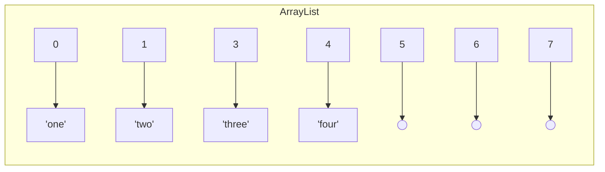
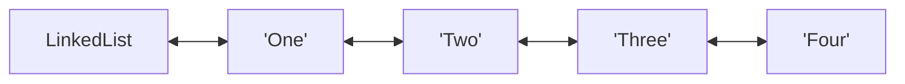

# Tietorakenteet ja algoritmit

Tällä viikolla tavoitteena on perehtyä tietorakenteiden ja algoritmien peruskäsitteisiin. Opettelemme arvioimaan karkeasti erilaisten algoritmisten lähestymistapojen soveltuvuutta kohtaamiimme ohjelmointiongelmiin.

> *Algoritmi (algorithm) on toimintaohje, jota seuraamalla voimme ratkaista jonkin laskennallisen ongelman. Algoritmille annetaan syöte (input), joka kuvaa ratkaistavan ongelman tapauksen, ja algoritmin tulee tuottaa tuloste (output), joka on vastaus sille annettuun syötteeseen*
>
> *Antti Laaksonen, [Tietorakenteet ja algoritmit -kirja](https://github.com/pllk/tirakirja/raw/master/tirakirja.pdf)*

Ohjelmointikielinä tällä kurssilla on Java, mutta myös muista yleisimmistä kielistä löytyy vastaavat tietorakenteet samoilla ominaispiirteillä. Esimerkiksi JavaScriptistä löytyvät [Array](https://developer.mozilla.org/en-US/docs/Web/JavaScript/Reference/Global_Objects/Array), [Map](https://developer.mozilla.org/en-US/docs/Web/JavaScript/Reference/Global_Objects/Map) ja [Object](https://developer.mozilla.org/en-US/docs/Web/JavaScript/Reference/Global_Objects/Object). TypeScriptistä löytyy näiden lisäksi [Record](https://www.typescriptlang.org/docs/handbook/utility-types.html#recordkeys-type), joka auttaa Object-olioiden tyypityksessä.

Tavoitteenamme ei ole oppia laskemaan tai esittämään algoritmiemme tarkkaa tehokkuutta matemaattisilla kaavoilla, vaan käytämme laskukaavoja apuvälineenä ymmärtääksemme, miksi jokin algoritmi suoriutuu samasta tehtävästä tehokkaammin kuin toinen. Emme myöskään harjoittele optimoimaan ohjelmiemme suorituskykyä, vaikka suorituskyky toimiikin tärkeänä mittarina tällä viikolla.


## Esimerkki ja tuntitehtävä

Tämän tekstimateriaalin ohessa suosittelemme perehtymään kurssin [wordplay-exercise](https://github.com/ohjelmointi2/wordplay-exercise)-esimerkkiin ja siihen liittyvään koodaustehtävään. [https://github.com/ohjelmointi2/wordplay-exercise](https://github.com/ohjelmointi2/wordplay-exercise)


## Tietorakenteiden ja algoritmien merkitys

Ohjelmointiongelmien ratkaisemisessa algoritmien lisäksi myös tietorakenteilla on erittäin merkittävä rooli. Tietorakenteiden "ulkoinen toteutus" vaikuttaa siihen, kuinka kätevää sitä on käsitellä ohjelmakoodissa. Ulkoisesti samanlaiset tietorakenteet, esimerkiksi `LinkedList` ja `ArrayList`, voivat poiketa toisistaan merkittävästi niiden suorituskyvyn osalta.

Esimerkiksi `ArrayList` on toteutettu nimensä mukaisesti sisäisesti taulukon avulla:

<!--index | value
------|------
0     | `"one"`
1     | `"two"`
2     | `"three"`
3     | `"four"`-->



Koska `ArrayList`-rakenteen sisältämän taulukon pituus ei voi muuttua, varataan siihen tyypillisesti hieman "kasvuvaraa", jotta taulukkoa ei jouduta korvaamaan isommalla heti seuraavaa arvoa lisättäessä. Yllä olevassa kuvaajassa indeksit 5-7 havainnollistavat tätä kasvuvaraa.

`LinkedList`-tietorakenteessa puolestaan arvot on "linkitetty" toisiinsa:



Linkitetyssä listassa arvojen ei tarvitse olla muistissa peräkkäin, joten listan keskelle ja alkuun voidaan lisätä uusia arvoja siirtämättä ainuttakaan olemassa olevaa arvoa. Listan kasvattaminen ei myöskään edellytä sisällön kopioimista suurempaan muistialueeseen. Javan tapauksessa `LinkedList` on toteutettu molempiin suuntiin linkitettynä, joten listaa voidaan käydä läpi myös lopusta alkuun, mikäli etsittävä indeksi sijaitsee lähempänä listan loppua.

{: .chatgpt }
> "Javan `ArrayList` ja `LinkedList` ovat kaksi erilaista tietorakennetta, joilla on omat vahvuutensa ja heikkoutensa.
>
> `ArrayList` tallentaa elementit peräkkäin muistissa, mahdollistaen nopean suoran indeksoinnin, mutta lisäys ja poisto keskeltä listaa voi olla hidasta siirtojen vuoksi.
>
> Toisaalta `LinkedList` tallentaa elementit viittausten avulla, mikä tekee lisäyksestä ja poistosta nopeaa, mutta suora indeksointi voi olla hidas, sillä se vaatii listan läpikäynnin halutun indeksin löytämiseksi.
>
> Suorituskyvyn osalta `ArrayList` sopii paremmin tilanteisiin, joissa tarvitaan paljon satunnaista pääsyä tietoihin, kun taas `LinkedList` voi olla tehokkaampi useiden lisäysten ja poistojen tapauksessa listan keskeltä."

Yllä esitettyjä suorituskykyeroja havainnollistetaan kurssin [wordplay-exercise](https://github.com/ohjelmointi2/wordplay-exercise)-esimerkkiprojektissa sekä videolla [LinkedList vs ArrayList in Java Tutorial - Which Should You Use? (Coding with John, YouTube)](https://youtu.be/5dscMs2hnDI?t=22)

```quiz
---
shuffleQuestions: false
shuffleAnswers: false
---

### Miksi Javassa on erillinen ArrayList, kun siellä on jo taulukkorakenne (array)?

- [x] ArrayList mahdollistaa pituuden kasvattamisen ja vähentämisen dynaamisesti, kun taas taulukoilla on kiinteä koko niiden luomisen jälkeen.
  > Tämä väite on tosi
- [x] ArrayList tarjoaa lisämetodeja arvojen helppoon lisäämiseen, poistamiseen ja etsimiseen, joita taulukot eivät tue.
  > Tämä väite on tosi
- [x] ArrayList sisältää apumetodeja kuten toString(), equals() ja contains(), joita taulukoilta ei suoraan löydy.
  > Tämä väite on tosi
- [x] ArrayList mahdollistaa soveltavien tietorakenteiden, kuten pinon (stack) ja jonon (queue), toteuttamisen sen tarjoamien metodien avulla.
  > Tämä väite on tosi
```


## Tiedon tallentaminen omissa sovelluksissamme

Tallentaessamme itse tietoa ohjelmiimme voimme itse vaikuttaa suuresti siihen, kuinka helposti ja nopeasti tallentamamme tieto on ohjelmakoodissa saatavilla. Vertaa esimerkiksi seuraavia mahdollisia tietorakenteita postinumeroiden ja postitoimipaikkojen tietojen tallentamiseksi.

Jos esittäisimme esimerkiksi postinumeroaineistoa monirivisenä merkkijonona, yksittäisten numeroiden ja nimien käsittely olisi epäkäytännöllistä:

```java
String postinumerot = """
        79700,Heinävesi
        86240,Pyhänkoski
        97390,Kierinki
        00900,Helsinki
        02760,Espoo
        02140,Espoo
        """;

// miten etsin nimen postinumerolle 97390?! 😢
```

Sen sijaan datan esittäminen `Map`-tietorakenteen avulla tekee siitä helpommin käsiteltävää:

```java
Map<String, String> postinumerot = Map.of(
        "74701", "Kiuruvesi",
        "35540", "Juupajoki",
        "97390", "Kierinki",
        "74700", "Kiuruvesi",
        "73460", "Muuruvesi"
);
```

Tiedon jäsentelytapa on yllä hyvin samankaltainen kuin seuraavassa JSON-esimerkissä:

```json
{
    "74701": "Kiuruvesi",
    "35540": "Juupajoki",
    "97390": "Kierinki",
    "74700": "Kiuruvesi",
    "73460": "Muuruvesi"
}
```

Toisaalta useissa tapauksissa pelkän "raakadatan" sijasta haluamme, että data sisältää myös sen käsittelemiseen tarvittavia operaatioita. Tällaisessa tapauksessa voi olla kannattavaa luoda esimerkiksi lista `Postinumero`-olioita:

```java
List<Postinumero> postinumerot = List.of(
        new Postinumero("74701", "Kiuruvesi"),
        new Postinumero("35540", "Juupajoki"),
        new Postinumero("97390", "Kierinki"),
        new Postinumero("74700", "Kiuruvesi"),
        new Postinumero("73460", "Muuruvesi")
);
```

Käsiteltävästä datasta riippuen eri tietueilla voi olla hyvin monenlaisia suhteita. Yllä olevissa esimerkeissä esimerkiksi Kiuruvedellä on useampia postinumeroita, joten voisimme esittää dataa Map-tietorakenteella, jonka arvoina on listoja:

```java
Map<String, List<String>> postinumerot = Map.of(
        "Kiuruvesi", List.of("74701", "74700"),
        "Juupajoki", List.of("35540"),
        "Muuruvesi", List.of("73460")
);
```

JSON-muodossa edellinen tietorakenne olisi havainnollistettavissa seuraavasti:

```json
{
    "kiuruvesi": ["74701", "74700"],
    "juupajoki": ["35540"],
    "muuruvesi": ["73460"]
}
```

{: .think }
Jos tarkoituksesi olisi selvittää postinumeroa `74700` vastaava postitoimipaikan nimi, mitä sen selvittäminen vaatisi yllä esitetyillä tietorakenteilla? Entä mikä tietorakenne olisi myöhemmin helpommin laajennettavissa, jos postinumeroalueita varten halutaan tallentaa toimipaikan nimen lisäksi myös muita tietoja?

```quiz
---
shuffleQuestions: false
shuffleAnswers: false
---

### Mistä yllä esitetyistä tietorakenteista on yksinkertaisinta etsiä postinumeroa vastaava toimipaikan nimi?

- [ ] String postinumerot
  > Jos koko tietoaineisto on yhtenä merkkijonona, etsittävä postinumero ja sitä vastaava nimi saattavat sijaita missä tahansa
- [x] Map&lt;String, String&gt; postinumerot
  > Edellä esitetystä Map-tietorakenteesta postinumeroa vastaava nimi löytyy suoraan get()-metodilla.
- [ ] List&lt;Postinumero&gt; postinumerot
  > Väärin. Postinumeron etsiminen edellyttää koko listan läpikäyntiä ja jokaisen toimipaikan tarkastamista.
- [ ] Map&lt;String, List&lt;String&gt;&gt; postinumerot
  > Väärin. Tässä tietorakenteessa avaimina olivat toimipaikkojen nimet ja arvoina postinumerot. Postinumerolla etsiminen edellyttäisi siis map:in sisältämien listojen läpikäyntiä ja oikeaa listaa vastaavan avaimen, eli nimen, valitsemista.
```

```quiz
---
shuffleQuestions: false
shuffleAnswers: false
---

### Mihin yllä esitetyistä tietorakenteista olisi suoraviivaisinta lisätä uusia tietoja, kuten postitoimipaikan ruotsin- ja englanninkieliset nimet?

- [ ] String postinumerot
- [ ] Map&lt;String, String&gt; postinumerot
- [x] List&lt;Postinumero&gt; postinumerot
  > Postinumero-luokkaa voidaan muuttaa ilman, että tähän tietorakenteeseen joudutaan koskemaan
- [ ] Map&lt;String, List&lt;String&gt;&gt; postinumerot
```

## Suositeltu oheismateriaali

Tietojenkäsittelyssä sama ongelma voidaan tyypillisesti ratkaista lukemattomilla erilaisilla tavoilla. Onkin olemassa lukuisia tunnettuja algoritmeja esimerkiksi listan arvojen järjestelemiseksi tai yksittäisen arvon etsimiseksi listalta.

Erityisesti mikäli opiskelet tämän aiheen itsenäisesti, suosittelemme sinua katsomaan seuraavat kolme videota, joka esittelevät ohjelmistokehittäjän perusosaamisen kannalta keskeisiä algoritmeja sekä tietorakenteita. Videoissa tutustut myös "big O"-notaatioon, jonka avulla vertailemme algoritmien tehokkuutta eri kokoisilla syötteillä:

* [What Is an Algorithm?](https://youtu.be/PY82qqyWJJs) 7:54

    > *We evaluate an algorithm mainly based on how many steps the algorithm takes to solve its problem* &mdash; *[What Is an Algorithm?](https://youtu.be/PY82qqyWJJs)*

* [Practical Big-O Notation](https://youtu.be/e6UZ2kzmmdA) 12:59

    > *Big-O notation is how the efficiency of algorithms is typically described. Figuring out the O-notation of an algorithm can look tricky, but as this video shows, for the majority of situations, it's pretty straightforward.* &mdash; *[Practical Big-O Notation](https://youtu.be/e6UZ2kzmmdA)*

* [Data Structures You Must Know (as a Software Developer)](https://youtu.be/sVxBVvlnJsM) 7:22

    > *Linked Lists, Arrays, Hash Table, Stack, Queue, Graph, Tree, Binary Search Tree...*

    Tätä videota vastaava esittely tärkeistä tietorakenteista löytyy myös tekstimuodossa [GoDaddy-palvelun blogista](https://in.godaddy.com/blog/8-basic-data-structures-every-programmer-should-know/).


## Algoritmien laadun arviointi

Eri algoritmien laatua arvioitaessa arvioidaan usein sitä, kuinka algoritmin suorituskyky muuttuu suhteessa sen käsittelemän datan määrän eli syötteen koon mukaan:

> *Algoritmin tehokkuus riippuu siitä, montako askelta se suorittaa. Tavoitteemme on nyt arvioida algoritmin askelten määrää suhteessa syötteen kokoon **n**. Esimerkiksi jos syötteenä on taulukko, **n** on taulukon koko, ja jos syötteenä on merkkijono, **n** on merkkijonon pituus.*
>
> Antti Laaksonen. [Tietorakenteet ja algoritmit -kirja](https://github.com/pllk/tirakirja/raw/master/tirakirja.pdf)

Tehokkuutta mitataan usein sekä muistin käytön että algoritmin suorittamien askelien lukumäärän perusteella suhteessa käsiteltävän datan määrään. Tehottomasti toteutettu algoritmi saattaa esimerkiksi tehdä lukuisia kopioita saamastaan syötteestä tai käydä samoja arvoja toistuvasti läpi.

Tyypillinen ilmaisutapa algoritmin suoritusajalle on ns. "iso-O -notaatio", joka kuvaa askelien lukumäärää, joka algoritmilta kuluu maksimissaan halutun lopputuloksen saavuttamiseksi.

Seuraava koodiesimerkki havainnollistaa [kuuluisan kuplalajittelun (bubble sort)](https://www.righto.com/2012/11/obama-on-sorting-1m-integers-bubble.html) toimintalogiikkaa ja siinä esiintyvää toistoa, joka suoritetaan pahimmillaan <code>O(n<sup>2</sup>)</code> kertaa:

```java
// kuplalajittelu järjestää annetun kokonaislukutaulukon kasvavaan järjestykseen
public static void bubbleSort(int[] arr) {
    int n = arr.length;

    // Ulompi toisto huolehtii siitä, että kaikki indeksit käydään läpi
    for (int i = 0; i < n - 1; i++) {

        // Sisempi toistorakenne vertaa ja vaihtaa peräkkäisiä keskenään,
        // jos ne ovat keskenään väärässä järjestyksessä:
        for (int j = 0; j < n - i - 1; j++) {

            // Kaksi peräkkäistä väärässä järjestyksessä?
            if (arr[j] > arr[j + 1]) {

                // Vaihdetaan `j` ja `j+1` keskenään!
                int temp = arr[j];
                arr[j] = arr[j + 1];
                arr[j + 1] = temp;
            }
        }
    }
}
```

Vaikka kuplalajittelun tehokkuus riittää erinomaisesti kymmenien, satojen tai jopa tuhansien arvojen lajittelemiseen, sen suorituskyky heikkenee aina neliöllisesti suhteessa aineiston kokoon. Jos siis taulukon pituus kymmenkertaistuu, suoritusaika kasvaa satakertaisesti. Vaikka kuplalajittelu monien muiden lajittelualgoritmien tavoin ei sovellu suurten tietomäärien järjestämiseen, se on silti kohtuullisen yksinkertainen toteuttaa ja ymmärtää, minkä vuoksi se sopii ohjelmoinnin harjoitteluun.

{: .huom }
Lajittelualgoritmit ovat erinomainen tapa harjoitella algoritmien toteuttamista. Oikeassa ohjelmassa käytät todennäköisesti Javan valmista lajittelualgoritmia esimerkiksi listan `sort`-metodin tai stream:in `sorted`-metodin avulla. Javan [sisäänrakennettu lajittelualgoritmi](https://github.com/openjdk/jdk/blob/master/src/java.base/share/classes/java/util/TimSort.java) perustuu [TimSort-algoritmiin](https://en.wikipedia.org/wiki/Timsort).


## Kyselyt

Seuraavien kyselyiden vastaukset eivät löydy suoraan kurssin materiaaleista, vaan joudut perehtymään kysymyksissä esiintyviin termehin ja väitteisiin hyödyntäen muita lähteitä.

```quiz
---
shuffleQuestions: false
shuffleAnswers: false
---

### Mitkä seuraavista tietorakenteita koskevista väitteistä ovat totta?

- [ ] Map-tietorakenne voi sisältää saman avaimen moneen kertaan
  > Map-tietorakenne ei voi sisältää samaa avainta useaan kertaan. Jokainen avain on uniikki, ja se liitetään yhteen arvoon.
- [x] Map-tietorakenne voi sisältää saman arvon moneen kertaan
  > Map-tietorakenne voi sisältää saman arvon useaan kertaan eri avaimilla. Arvot eivät kuitenkaan ole uniikkeja.
- [x] ArrayList ja LinkedList voivat sisältää saman arvon moneen kertaan
  > Sekä ArrayList että LinkedList voivat sisältää saman arvon useaan kertaan.
- [x] TreeMap järjestää sisältönsä aina avaimen perusteella "kasvavaan" järjestykseen
  TreeMap järjestää avaimet luonnolliseen eli kasvavaan järjestykseen
- [x] HashMap pyrkii hajauttamaan sisältönsä mahdollisimman satunnaisesti
  > HashMap pyrkii hajauttamaan avaimet mahdollisimman satunnaisesti käyttäen hashCode-funktiota.
- [x] Map-tietorakenteessa arvoina voi olla myös muita kokoelmia, kuten listoja
  > Map-tietorakenteessa arvoina voi olla muita kokoelmia, kuten listoja, jotka ovat hyödyllisiä monimutkaisemman datan tallentamisessa.
- [x] Listoissa arvoina voi olla myös muita kokoelmia, kuten Map:eja
  > Listoissa arvoina voi olla muita kokoelmia, kuten Map:eja, mikä mahdollistaa monipuolisten tietorakenteiden luomisen ja käytön.
```

```quiz
---
shuffleQuestions: false
shuffleAnswers: false
---

### HashMap-olioilla on tietty kapasiteetti. Mitkä seuraavista kapasiteettia koskevista väitteistä ovat totta?

- [ ] Täyden kapasiteetin saavuttaminen aiheuttaa poikkeuksen
  > Väärin. HashMap laajenee automaattisesti ja siirtää kaiken datan uuteen, suurempaan taulukkoon
- [x] HashMap laajenee automaattisesti ja siirtää kaiken datan uuteen, suurempaan taulukkoon
  > Totta. Kehittäjän näkökulmastas kaikki tapahtuu automaattisesti taustalla.
- [ ] HashMap poistaa vanhimpia arvoja sitä mukaan kun se tarvitsee tilaa uusille
  > HashMap laajenee automaattisesti ja siirtää kaiken datan uuteen, suurempaan taulukkoon
- [x] Kehittäjän ei tarvitse itse huolehtia HashMap:in koon muuttamisesta
  > HashMap varaa muistia ja siirtää sisältönsä automaattisesti taustalla
- [ ] HashMap:in suorituskyky paranee sitä mukaa, mitä täydempi se on
  > Väärin. Täysi HashMap voi hidastaa suorituskykyä, jos eri avaimet eivät pääse "oikeille" paikoilleen. Tällöin avaimia joudutaan etsimään vaihtoehtoisista sijainneista.
- [ ] HashMap:in suorituskyky heikkenee sitä mukaa, mitä täydempi se on
  > Totta. Täysi HashMap voi hidastaa suorituskykyä, jos eri avaimet eivät pääse "oikeille" paikoilleen. Tällöin avaimia joudutaan etsimään vaihtoehtoisista sijainneista.
```

```quiz
---
shuffleQuestions: false
shuffleAnswers: false
---

### Mitkä seuraavista algoritmeja koskevista väitteistä ovat totta?

- [x] Algoritmi, jonka suoritusaika on "n", suorittaa yhden operaation jokaista syötteen arvoa kohden
  > Tämä väite on totta. Algoritmi, jonka suoritusaika on "n", suorittaa yhden operaation jokaista syötteen arvoa kohti.
- [x] Algoritmi, jonka suoritusaika on "n^2", suorittaa saamansa syötteen verran operaatioita jokaista syötteen arvoa kohden
  > Tämä väite on totta. Algoritmi, jonka suoritusaika on "n^2", suorittaa saamansa syötteen verran operaatioita jokaista syötteen arvoa kohti.
- [x] Puolitushaku edellyttää, että läpikäytävä kokoelma on järjestyksessä
  > Tämä väite on totta. Puolitushaku edellyttää, että läpikäytävä kokoelma on järjestyksessä.
- [x] HashMap kutsuu lisättävien avainten hashCode-metodia selvittääkseen, mihin kohtaan avain tallennetaan muistissa
  > Tämä väite on totta. HashMap käyttää avainten hashCode-metodia selvittääkseen, mihin kohtaan avain tallennetaan muistissa.
- [x] Listan "contains()"-metodi suorittaa lineaarisen haun ja käy tarvittaessa kaikki arvot läpi
  > Tämä väite on totta. Listan "contains()"-metodi suorittaa lineaarisen haun ja käy tarvittaessa kaikki arvot läpi.
- [ ] HashMapin "containsKey"-metodi suorittaa lineaarisen haun ja käy tarvittaessa kaikki avaimet läpi
  > Tämä väite on väärin. Eri tyyppiset Map:it tallentavat avaimet eri logiikoilla siten, että jokaiselle avaimelle on vain yksi "oikea paikka", josta etsiä. Kaikista paikoista joudutaan etsimään vain äärimmäisessä tapauksessa, jossa avainten hajautusfunktio tuottaa kaikille avaimille saman sijainnin muistissa.
- [x] HashMapin "containsValue"-metodi suorittaa lineaarisen haun ja käy tarvittaessa kaikki arvot läpi
  > Tämä väite on totta. Toisin kuin avaimet, mapiin tallennetut arvot saattavat sijaita missä vain kohdassa, joten ne on kaikki käytävä läpi.
```

# Rekursio

> Rekursio on matemaattinen keino määritellä funktioita niin, että funktion arvo tietyssä pisteessä riippuu funktion arvosta edellisessä pisteessä. 
> Myös tietotekniikassa käytetään rekursiivisia ohjelmarutiineja. [Wikipedia](https://fi.wikipedia.org/wiki/Rekursio)

Kertoma on hyvin tyypillinen esimerkki tilanteesta missä voi soveltaa rekursiota tai rekursiivista algoritmia. Kertoma on tuttu koulun matematiikan tunnilta, mutta kertauksen vuoksi todettakoon että esimerksi viiden kertoma (5!) on 1 * 2 * 3 * 4 * 5 = 120.
Kertoma on laskettavissa toistorakenteen avulla:
```java
int tulos = 1;
int luku = 5;
for (int i = 1; i <= luku; i++) {
    tulos *= i;
}
System.out.println("Luvun " + luku + " kertoma on " + tulos);
```
Toinen mahdollisuus on käyttää rekursiivista metodia kertoman laskentaan. Rekursiivinen metodi kutsuu itseään. 
```java
int kertoma(int n) {
    if (n == 1) return 1;
    return n * kertoma(n-1);
}
```
Tässä tapauksessa metodia kutsutaan näin: 
```java
System.out.println("Luvun " + luku + " kertoma on " + kertoma(luku));
```
Toiminta selviää parhaiten joko kynän ja paperin avulla tai vielä helpommin debuggaamalla koodia. Rekursiivisissa -metodeissa on erittäin tärkeää, että rekursio (itsensä kutsuminen) päättyy joskus. Rekursiivisia algoritmeja voidaan käyttää vaikka puumaisten rekenteiden läpikäynnissä. Puusta puhuttaessa, tutkitaan miten kuusen tulostaminen voidaan tehdä rekursion avulla. Seuraava koodiesimerkki tulostaa merkkigrafiikalla konsolille kuusen, kun annetaan kuusen korkeus. 

```java
// kuusi tulostetaan kutsulla
System.out.print("Anna kuusen korkeus: ");
int k = new Scanner(System.in).nextInt();
tulostaKuusi(k, System.out);

public static void tulostaKuusi(int korkeus, PrintStream output) {
    String s = kuusi(1, korkeus);
    output.println(s);
}

public static String kuusi(int oksa, int korkeus) {
    return oksa < korkeus ? " ".repeat(korkeus - oksa) + "/".repeat(oksa) + "\\".repeat(oksa) + "\n" + kuusi(oksa + 1, korkeus) 
        : (" ".repeat(korkeus - 1) + "||");
}
```
Edellinen tulostuskoodi on tehtävissä ilman rekursiota silmukoiden avulla. Luultavasti vielä yksinkertaisemmin ja helpommin ymmärrettävästi.
Rekursio käsitteenä on syytä tuntea ja ymmärtää sen toiminta, vaikka kovin usein et joudukaan rekursiivista koodia toteuttamaan.

Aito esimerkki puumaisen rakenteen läpikäynnistä on rekursiolla toteutettu hakemiston alla olevien tiedostojen laskenta.
```java
public static int laskeTiedostot(String hakemisto) throws IOException {
    int laskuri = 0;
    var fl = Files.list(Paths.get(hakemisto)).toList();
    for (Path polku : fl) {
        if (Files.isDirectory(polku)) {
                laskuri += laskeTiedostot(polku.toString());   
        }
        else{ 
            laskuri++;
        }
    }
    return laskuri;
}
```



