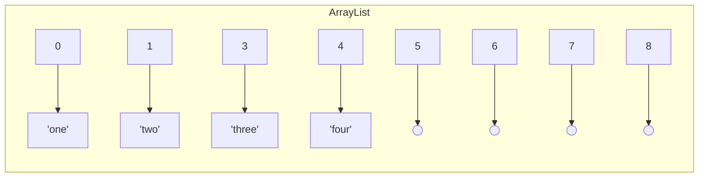

# Tietorakenteet ja algoritmit

Tällä viikolla tavoitteena on perehtyä tietorakenteiden ja algoritmien peruskäsitteisiin. Opettelemme arvioimaan karkeasti erilaisten algoritmisten lähestymistapojen soveltuvuutta kohtaamiimme ohjelmointiongelmiin.

> *Algoritmi (algorithm) on toimintaohje, jota seuraamalla voimme ratkaista jonkin laskennallisen ongelman. Algoritmille annetaan syöte (input), joka kuvaa ratkaistavan ongelman tapauksen, ja algoritmin tulee tuottaa tuloste (output), joka on vastaus sille annettuun syötteeseen*
>
> *Antti Laaksonen, [Tietorakenteet ja algoritmit -kirja](https://github.com/pllk/tirakirja/raw/master/tirakirja.pdf)*

Ohjelmointikielinä tällä kurssilla on Java, mutta myös muista yleisimmistä kielistä löytyy vastaavat tietorakenteet samoilla ominaispiirteillä. Esimerkiksi JavaScriptistä löytyvät [Array](https://developer.mozilla.org/en-US/docs/Web/JavaScript/Reference/Global_Objects/Array), [Map](https://developer.mozilla.org/en-US/docs/Web/JavaScript/Reference/Global_Objects/Map) ja [Object](https://developer.mozilla.org/en-US/docs/Web/JavaScript/Reference/Global_Objects/Object). TypeScriptistä löytyy näiden lisäksi [Record](https://www.typescriptlang.org/docs/handbook/utility-types.html#recordkeys-type), joka auttaa Object-olioiden tyypityksessä.

Tavoitteenamme ei ole oppia laskemaan tai esittämään algoritmiemme tarkkaa tehokkuutta matemaattisilla kaavoilla, vaan käytämme laskukaavoja apuvälineenä ymmärtääksemme, miksi jokin algoritmi suoriutuu samasta tehtävästä tehokkaammin kuin toinen. Emme myöskään harjoittele optimoimaan ohjelmiemme suorituskykyä, vaikka suorituskyky toimiikin tärkeänä mittarina tällä viikolla.


## Esimerkki ja tuntitehtävä

Tämän tekstimateriaalin ohessa suosittelemme perehtymään kurssin [wordplay-exercise](https://github.com/ohjelmointi2/wordplay-exercise)-esimerkkiin ja siihen liittyvään koodaustehtävään. [https://github.com/ohjelmointi2/wordplay-exercise](https://github.com/ohjelmointi2/wordplay-exercise)


## Tietorakenteiden ja algoritmien merkitys

Ohjelmointiongelmien ratkaisemisessa algoritmien lisäksi myös tietorakenteilla on erittäin merkittävä rooli. Tietorakenteiden "ulkoinen toteutus" vaikuttaa siihen, kuinka kätevää sitä on käsitellä ohjelmakoodissa. Ulkoisesti samanlaiset tietorakenteet, esimerkiksi `LinkedList` ja `ArrayList`, voivat poiketa toisistaan merkittävästi niiden suorituskyvyn osalta.

Esimerkiksi `ArrayList` on toteutettu nimensä mukaisesti sisäisesti taulukon avulla:

<!--index | value
------|------
0     | `"one"`
1     | `"two"`
2     | `"three"`
3     | `"four"`-->



Koska `ArrayList`-rakenteen sisältämän taulukon pituus ei voi muuttua, varataan siihen tyypillisesti hieman "kasvuvaraa", jotta taulukkoa ei jouduta korvaamaan isommalla heti seuraavaa arvoa lisättäessä. Yllä olevassa kuvaajassa indeksit 5-8 havainnollistavat tätä kasvuvaraa.

`LinkedList`-tietorakenteessa puolestaan arvot on "linkitetty" toisiinsa:


{: .chatgpt }
> "Javan `ArrayList` ja `LinkedList` ovat kaksi erilaista tietorakennetta, joilla on omat vahvuutensa ja heikkoutensa.
>
> `ArrayList` tallentaa elementit peräkkäin muistissa, mahdollistaen nopean suoran indeksoinnin, mutta lisäys ja poisto keskeltä listaa voi olla hidasta siirtojen vuoksi.
>
> Toisaalta `LinkedList` tallentaa elementit viittausten avulla, mikä tekee lisäyksestä ja poistosta nopeaa, mutta suora indeksointi voi olla hidas, sillä se vaatii listan läpikäynnin halutun indeksin löytämiseksi.
>
> Suorituskyvyn osalta `ArrayList` sopii paremmin tilanteisiin, joissa tarvitaan paljon satunnaista pääsyä tietoihin, kun taas `LinkedList` voi olla tehokkaampi useiden lisäysten ja poistojen tapauksessa listan keskeltä."

Yllä esitettyjä suorituskykyeroja havainnollistetaan kurssin [wordplay-exercise](https://github.com/ohjelmointi2/wordplay-exercise)-esimerkkiprojektissa.


## Tiedon tallentaminen omissa sovelluksissamme

Tallentaessamme itse tietoa ohjelmiimme voimme itse vaikuttaa suuresti siihen, kuinka helposti ja nopeasti tallentamamme tieto on ohjelmakoodissa saatavilla. Vertaa esimerkiksi seuraavia mahdollisia tietorakenteita postinumeroiden ja postitoimipaikkojen tietojen tallentamiseksi.

Jos esittäisimme esimerkiksi postinumeroaineistoa monirivisenä merkkijonona, yksittäisten numeroiden ja nimien käsittely olisi epäkäytännöllistä:

```java
String postinumerot = """
        79700,Heinävesi
        86240,Pyhänkoski
        97390,Kierinki
        00900,Helsinki
        02760,Espoo
        02140,Espoo
        """;

// miten etsin nimen postinumerolle 97390?! 😢
```

Sen sijaan datan esittäminen `Map`-tietorakenteen avulla tekee siitä helpommin käsiteltävää:

```java
Map<String, String> postinumerot = Map.of(
        "74701", "Kiuruvesi",
        "35540", "Juupajoki",
        "97390", "Kierinki",
        "74700", "Kiuruvesi",
        "73460", "Muuruvesi"
);
```

Tiedon jäsentelytapa on yllä hyvin samankaltainen kuin seuraavassa JSON-esimerkissä:

```json
{
    "74701": "Kiuruvesi",
    "35540": "Juupajoki",
    "97390": "Kierinki",
    "74700": "Kiuruvesi",
    "73460": "Muuruvesi"
}
```

Toisaalta useissa tapauksissa pelkän "raakadatan" sijasta haluamme, että data sisältää myös sen käsittelemiseen tarvittavia operaatioita. Tällaisessa tapauksessa voi olla kannattavaa luoda esimerkiksi lista `Postinumero`-olioita:

```java
List<Postinumero> postinumerot = List.of(
        new Postinumero("74701", "Kiuruvesi"),
        new Postinumero("35540", "Juupajoki"),
        new Postinumero("97390", "Kierinki"),
        new Postinumero("74700", "Kiuruvesi"),
        new Postinumero("73460", "Muuruvesi")
);
```

Käsiteltävästä datasta riippuen eri tietueilla voi olla hyvin monenlaisia suhteita. Yllä olevissa esimerkeissä esimerkiksi Kiuruvedellä on useampia postinumeroita, joten voisimme esittää dataa Map-tietorakenteella, jonka arvoina on listoja:

```java
Map<String, List<String>> postinumerot = Map.of(
        "Kiuruvesi", List.of("74701", "74700"),
        "Juupajoki", List.of("35540"),
        "Muuruvesi", List.of("73460")
);
```

JSON-muodossa edellinen tietorakenne olisi havainnollistettavissa seuraavasti:

```json
{
    "kiuruvesi": ["74701", "74700"],
    "juupajoki": ["35540"],
    "muuruvesi": ["73460"]
}
```

{: .think }
Jos tarkoituksesi olisi selvittää postinumeroa `74700` vastaava postitoimipaikan nimi, mitä sen selvittäminen vaatisi yllä esitetyillä tietorakenteilla? Entä mikä tietorakenne olisi myöhemmin helpommin laajennettavissa, jos postinumeroalueita varten halutaan tallentaa toimipaikan nimen lisäksi myös muita tietoja?


## Suositeltu oheismateriaali

Tietojenkäsittelyssä sama ongelma voidaan tyypillisesti ratkaista lukemattomilla erilaisilla tavoilla. Onkin olemassa lukuisia tunnettuja algoritmeja esimerkiksi listan arvojen järjestelemiseksi tai yksittäisen arvon etsimiseksi listalta.

Erityisesti mikäli opiskelet tämän aiheen itsenäisesti, suosittelemme sinua katsomaan seuraavat kolme videota, joka esittelevät ohjelmistokehittäjän perusosaamisen kannalta keskeisiä algoritmeja sekä tietorakenteita. Videoissa tutustut myös "big O"-notaatioon, jonka avulla vertailemme algoritmien tehokkuutta eri kokoisilla syötteillä:

* [What Is an Algorithm?](https://youtu.be/PY82qqyWJJs) 7:54

    > *We evaluate an algorithm mainly based on how many steps the algorithm takes to solve its problem* &mdash; *[What Is an Algorithm?](https://youtu.be/PY82qqyWJJs)*

* [Practical Big-O Notation](https://youtu.be/e6UZ2kzmmdA) 12:59

    > *Big-O notation is how the efficiency of algorithms is typically described. Figuring out the O-notation of an algorithm can look tricky, but as this video shows, for the majority of situations, it's pretty straightforward.* &mdash; *[Practical Big-O Notation](https://youtu.be/e6UZ2kzmmdA)*

* [Data Structures You Must Know (as a Software Developer)](https://youtu.be/sVxBVvlnJsM) 7:22

    > *Linked Lists, Arrays, Hash Table, Stack, Queue, Graph, Tree, Binary Search Tree...*

    Tätä videota vastaava esittely tärkeistä tietorakenteista löytyy myös tekstimuodossa [GoDaddy-palvelun blogista](https://in.godaddy.com/blog/8-basic-data-structures-every-programmer-should-know/).


## Algoritmien laadun arviointi

Eri algoritmien laatua arvioitaessa arvioidaan usein sitä, kuinka algoritmin suorituskyky muuttuu suhteessa sen käsittelemän datan määrän eli syötteen koon mukaan:

> *Algoritmin tehokkuus riippuu siitä, montako askelta se suorittaa. Tavoitteemme on nyt arvioida algoritmin askelten määrää suhteessa syötteen kokoon **n**. Esimerkiksi jos syötteenä on taulukko, **n** on taulukon koko, ja jos syötteenä on merkkijono, **n** on merkkijonon pituus.*
>
> Antti Laaksonen. [Tietorakenteet ja algoritmit -kirja](https://github.com/pllk/tirakirja/raw/master/tirakirja.pdf)

Tehokkuutta mitataan usein sekä muistin käytön että algoritmin suorittamien askelien lukumäärän perusteella suhteessa käsiteltävän datan määrään. Tehottomasti toteutettu algoritmi saattaa esimerkiksi tehdä lukuisia kopioita saamastaan syötteestä tai käydä samoja arvoja toistuvasti läpi.

Tyypillinen ilmaisutapa algoritmin suoritusajalle on ns. "iso-O -notaatio", joka kuvaa askelien lukumäärää, joka algoritmilta kuluu maksimissaan halutun lopputuloksen saavuttamiseksi.

Seuraava koodiesimerkki havainnollistaa [kuuluisan kuplalajittelun (bubble sort)](http://www.righto.com/2012/11/obama-on-sorting-1m-integers-bubble.html) toimintalogiikkaa ja siinä esiintyvää toistoa, joka suoritetaan pahimmillaan <code>O(n<sup>2</sup>)</code> kertaa:

```java
// kuplalajittelu järjestää annetun kokonaislukutaulukon kasvavaan järjestykseen
public static void bubbleSort(int[] arr) {
    int n = arr.length;

    // Ulompi toisto huolehtii siitä, että kaikki indeksit käydään läpi
    for (int i = 0; i < n - 1; i++) {

        // Sisempi toistorakenne vertaa ja vaihtaa peräkkäisiä keskenään,
        // jos ne ovat keskenään väärässä järjestyksessä:
        for (int j = 0; j < n - i - 1; j++) {

            // Kaksi peräkkäistä väärässä järjestyksessä?
            if (arr[j] > arr[j + 1]) {

                // Vaihdetaan `j` ja `j+1` keskenään!
                int temp = arr[j];
                arr[j] = arr[j + 1];
                arr[j + 1] = temp;
            }
        }
    }
}
```

Vaikka kuplalajittelun tehokkuus riittää erinomaisesti kymmenien, satojen tai jopa tuhansien arvojen lajittelemiseen, sen suorituskyky heikkenee aina neliöllisesti suhteessa aineiston kokoon. Jos siis taulukon pituus kymmenkertaistuu, suoritusaika kasvaa satakertaisesti.

{: .huom }
Lajittelualgoritmit ovat erinomainen tapa harjoitella algoritmien toteuttamista. Oikeassa ohjelmassa käytät todennäköisesti Javan valmista lajittelualgoritmia esimerkiksi listan `sort`-metodin tai stream:in `sorted`-metodin avulla. Javan [sisäänrakennettu lajittelualgoritmi](https://github.com/openjdk/jdk/blob/master/src/java.base/share/classes/java/util/TimSort.java) perustuu [TimSort-algoritmiin](https://en.wikipedia.org/wiki/Timsort).

